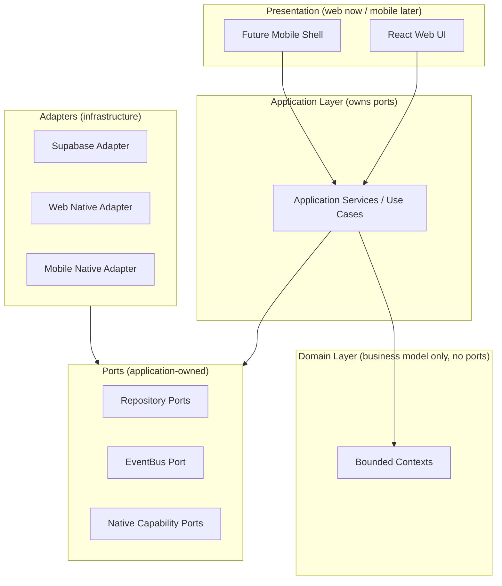

# Architecture Overview

> Sprint 0.1 — Architecture Correction. Status: **Approved for Sprint 1
> planning.** See `architecture-version.md` for versioning and `docs/adr/`
> for decisions.
>
> **[S4] Sprint 4:** The Person, Sports ID, AthleteProfile, participation, and
> minimal Sport reference slices now have durable PostgreSQL storage behind the
> unchanged repository contracts. Production requires a configured database and
> never falls back to in-memory storage. See `../persistence-model.md`,
> `operations/database.md`, and ADR-020/021/022.

## 1. Purpose

SportsOS is a Philippines-first but globally extensible sports ecosystem. Every
person has **one permanent Sports ID** and may hold **multiple roles**
(athlete, coach, organizer, official, team manager, guardian). A Person MAY
have at most one AthleteProfile — they do not automatically become an athlete
[C]. Athletes are **multi-sport**. The platform must eventually support
athlete Sports Passports, QR identity credentials, teams, clubs, organizers,
tournaments, leagues, events, registration, eligibility, paid entry fees,
payment/refund/settlement, event check-in, match scoring, verified
participation, championships, achievements, statistics, rankings, Sports
Points rewards, an immutable rewards ledger, a reward marketplace, sponsors,
officials, venues, schools, associations, LGUs, governing bodies, and
multi-country expansion.

This sprint **corrects the Sprint 0 architecture** based on review. No product
UI, authentication flows, database migrations, CRUD screens, payment
integrations, QR scanning, tournament engines, reward functionality, PWA
functionality, Android/iOS builds, or native plugins are built.

## 2. Delivery strategy

SportsOS launches first as a responsive **web application**:

- React + Vite + TypeScript + Tailwind CSS
- Mobile-first UX: mobile browsers, tablets, desktop
- Later distributable as Android and iOS apps **without rewriting domain or
  application logic**

Core **domain** and **application** layers must **not** depend on browser,
Android, iOS, PWA, Bolt, Supabase, Netlify, Stripe, or any specific
infrastructure provider. Future native capabilities are accessed through
**interfaces/adapters**.

## 3. Architectural style

Modular domain-driven architecture with **strict dependency boundaries** and
**ports/adapters** wherever infrastructure is required later.

**Key correction [C]:** Domain no longer depends on Ports. The application
layer owns ports. Dependency direction is strictly: Presentation → Application
→ Domain. Adapters implement ports. See `dependency-rules.md`, ADR-016.

## 4. Design for PostgreSQL-compatible persistence

The domain model is designed for PostgreSQL-compatible persistence but **no
persistence is implemented this sprint**. Repositories are defined as
application-owned ports only. A future Supabase adapter will implement them.

## 5. What this sprint delivers (corrections to Sprint 0)

- Corrected architecture documents (14 updated)
- New ADRs (010–018) for materially new decisions
- Updated source type definitions reflecting:
  - Person/SportsId as platform-global (no tenantId)
  - AthleteProfile as optional (renamed from Athlete)
  - Competition aggregates as independent lifecycles
  - Commerce as separated concepts (Order, PaymentAttempt, PaymentTransaction, Refund, Settlement, OrganizerPayout)
  - Rewards with idempotent issuance, reversal entries, source identity
  - QR credential full lifecycle states
  - Authorization via memberships/assignments (not flat PersonRole)
  - Domain no longer depends on ports

## 6. What this sprint explicitly does NOT deliver

- No product UI beyond the existing placeholder shell
- No authentication flows
- No database migrations or schema
- No CRUD screens
- No payment integration
- No QR scanning implementation
- No tournament engine or competition engine
- No reward functionality
- No PWA functionality
- No Android/iOS builds or native plugins
- No privacy workflow implementation

## 7. How to read this documentation

| If you want to know about… | Read |
|---|---|
| The rules and invariants | `architecture-rules.md` |
| Bounded contexts + ownership classifications | `bounded-contexts.md` |
| What may depend on what | `dependency-rules.md` |
| Person vs User vs AthleteProfile, Sports ID | `identity-model.md` |
| Memberships, assignments, authorization | `person-role-model.md` |
| Team vs Organization, tenancy | `organization-model.md` |
| Sport vs Discipline vs Competition | `sports-model.md` |
| Competition aggregate boundaries | `competition-model.md` |
| Registration boundary, participant vs payer | `registration-model.md` |
| Commerce model (Order, PaymentAttempt, etc.) | `commerce-model.md` |
| Results, achievements, immutability | `results-achievements-model.md` |
| Rewards ledger, idempotency, reversals | `rewards-model.md` |
| QR credential lifecycle, trust model | `qr-credentials-model.md` |
| Ownership classifications, tenant isolation | `tenancy.md` |
| Permission-based authorization | `authorization.md` |
| Geography & localization assumptions | `geography-localization.md` |
| Audit, integrity, retention/privacy | `audit-integrity.md` |
| Web/mobile platform boundary | `client-platforms.md` |
| Native distribution strategy | `mobile-strategy.md` |
| Offline event resilience | `offline-resilience.md` |
| Versioning | `architecture-version.md` |

ADRs (`docs/adr/`) record the irreversible or hard-to-reverse decisions.
Items marked **[C]** are Sprint 0.1 corrections.
