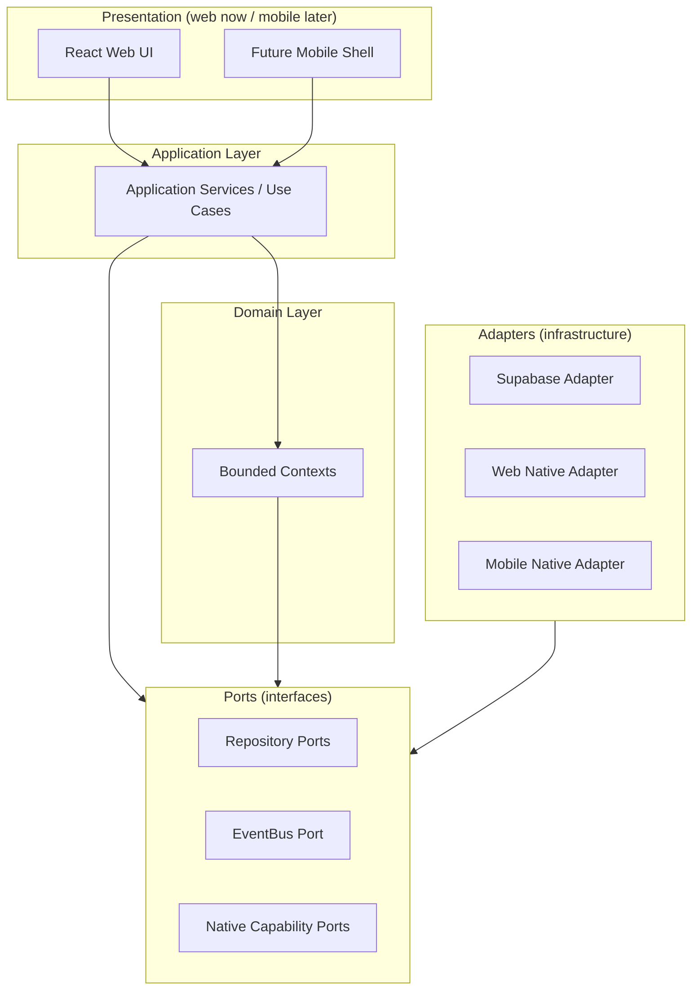

# Architecture Overview

> Sprint 0 — Architecture Only. Status: **Approved for Sprint 1 planning.**
> See `architecture-version.md` for versioning and `docs/adr/` for decisions.

## 1. Purpose

SportsOS is a Philippines-first but globally extensible sports ecosystem. Every
person has **one permanent Sports ID** and may hold **multiple roles**
(athlete, coach, organizer, official, team manager, guardian). Athletes are
**multi-sport**. The platform must eventually support athlete Sports Passports,
QR identity credentials, teams, clubs, organizers, tournaments, leagues,
events, registration, eligibility, paid entry fees, payment/refund/settlement,
event check-in, match scoring, verified participation, championships,
achievements, statistics, rankings, Sports Points rewards, an immutable rewards
ledger, a reward marketplace, sponsors, officials, venues, schools,
associations, LGUs, governing bodies, and multi-country expansion.

This sprint **defines the architecture only**. No product UI, authentication
flows, database migrations, CRUD screens, payment integrations, QR scanning,
tournament engines, reward functionality, PWA functionality, Android/iOS
builds, or native plugins are built yet.

## 2. Delivery strategy

SportsOS launches first as a responsive **web application**:

- React + Vite + TypeScript + Tailwind CSS
- Mobile-first UX: mobile browsers, tablets, desktop
- Later distributable as Android and iOS apps **without rewriting domain or
  application logic**

Core **domain** and **application** layers must **not** depend on browser,
Android, iOS, PWA, Bolt, Supabase, Netlify, Stripe, or any specific
infrastructure provider. Future native capabilities are accessed through
**interfaces/adapters**.

## 3. Architectural style

Modular domain-driven architecture with **strict dependency boundaries** and
**ports/adapters** wherever infrastructure is required later.

**Dependency direction is strictly inward / downward:** Presentation →
Application → Domain. Ports are interfaces owned by the application/domain
layer. Adapters implement ports and are the only place infrastructure is
referenced. See `dependency-rules.md`.

## 4. Design for PostgreSQL-compatible persistence

The domain model is designed for PostgreSQL-compatible persistence but **no
persistence is implemented this sprint**. Repositories are defined as ports
only. A future Supabase adapter will implement them. The append-only ledgers
(rewards, financial audit) are modeled to map naturally to Postgres
insert-only tables.

## 5. What this sprint delivers

- 21 architecture documents (this directory)
- 10 ADRs (`docs/adr/`)
- Minimal source/package structure expressing boundaries (`src/`):
  - `src/domain/<context>/` — bounded context type definitions
  - `src/ports/` — repository, event bus, native capability interfaces
  - `src/adapters/` — adapter seam (stubs)
  - `src/shared/` — shared kernel primitives
  - `src/app/` — application layer (reserved)
- A compiling React + Vite + TS + Tailwind shell that proves the build path

## 6. What this sprint explicitly does NOT deliver

- No product UI beyond a placeholder shell
- No authentication flows
- No database migrations or schema
- No CRUD screens
- No payment integration
- No QR scanning implementation
- No tournament engine
- No reward functionality
- No PWA functionality
- No Android/iOS builds or native plugins

## 7. How to read this documentation

| If you want to know about… | Read |
|---|---|
| The rules and invariants | `architecture-rules.md` |
| Bounded contexts | `bounded-contexts.md` |
| What may depend on what | `dependency-rules.md` |
| Person vs User vs Athlete, Sports ID | `identity-model.md` |
| Multi-role person model | `person-role-model.md` |
| Team vs Organization, tenancy | `organization-model.md` |
| Sport vs Discipline vs Event | `sports-model.md` |
| Competition formats, participant abstraction | `competition-model.md` |
| Registration boundary, participant vs payer | `registration-model.md` |
| Payment/commerce boundary | `commerce-model.md` |
| Results, achievements, immutability | `results-achievements-model.md` |
| Rewards ledger accounting | `rewards-model.md` |
| QR credential trust model | `qr-credentials-model.md` |
| Tenant isolation | `tenancy.md` |
| Permission-based authorization | `authorization.md` |
| Geography & localization assumptions | `geography-localization.md` |
| Audit & integrity | `audit-integrity.md` |
| Web/mobile platform boundary | `client-platforms.md` |
| Native distribution strategy | `mobile-strategy.md` |
| Offline event resilience | `offline-resilience.md` |
| Versioning | `architecture-version.md` |

ADRs (`docs/adr/`) record the irreversible or hard-to-reverse decisions.
