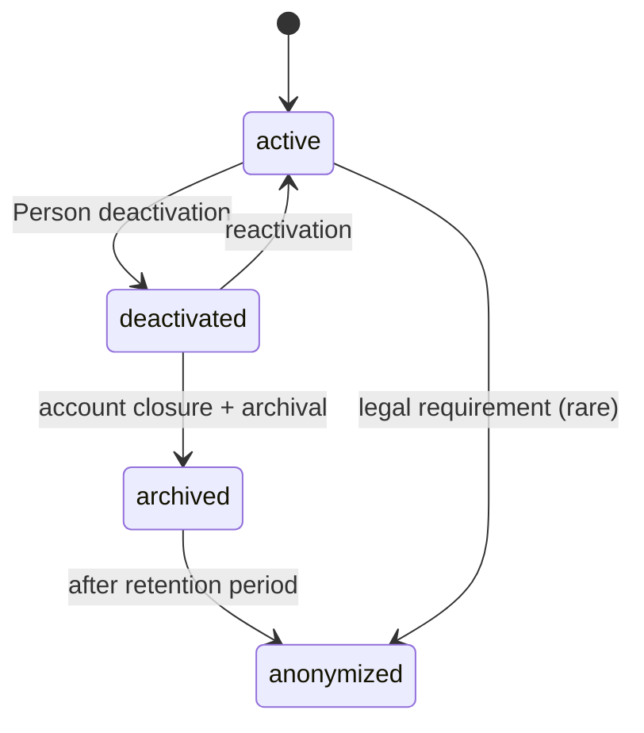

# Audit & Integrity

> Audit strategy, historical record integrity, and layered retention/privacy
> architecture. See R5, R16, R17, R20, ADR-011.

## Audit strategy

SportsOS treats audit as a first-class concern. Append-only ledgers, immutable
historical records, and a layered retention model form the audit backbone:

| Record | Owner | Mutability |
|---|---|---|
| `PaymentTransaction`, `Refund`, `Settlement`, `OrganizerPayout` | Commerce | Append-only [C] |
| `RewardsLedgerEntry` | Rewards | Append-only |
| `CompetitionResult` | Results | Append-only (amendments = new entries) |
| `Achievement` | Results | Immutable once verified |
| `IdentityVerification` | Credentials | Append-only (level upgrades are new records) |
| `Person` | Identity | Layered lifecycle (active → deactivated → archived → anonymized) [C] |

## Append-only means never mutate or delete

For both ledgers and results:

- A **correction** is a **new entry** that references the prior one, not an
  update. (Results: `amended` status with a `supersedes` link. Rewards: a
  `reversal` entry with `reversesEntryId`. Commerce: a `Refund` referencing
  the original `PaymentTransaction`.)
- A **void** is a terminal status / new entry, not a delete.
- **Reversals** (refunds, reward reversals) are new entries with opposite
  signed values, never mutations of the original.

This means any point-in-time state can be reconstructed by replaying the
append-only sequence from the beginning — the definition of an audit log.

## [C] Layered retention and deletion model

Sprint 0 had a blanket "soft delete only" assumption. Sprint 0.1 replaces it
with a layered model that separates distinct concerns. Historical
sporting/financial records may be preserved without retaining unnecessary
personal data indefinitely.

| Layer | What happens | Personal data | Historical records |
|---|---|---|---|
| **Account closure** | `User` (auth subject) disabled. Login stops. | Preserved | Untouched |
| **Person deactivation** | `Person.lifecycleStatus` → `deactivated`. No new activity permitted. | Preserved | Untouched |
| **Identity archival** | `Person.lifecycleStatus` → `archived`. Immutable record. | Preserved (minimal set) | Untouched |
| **Legal/business retention** | Records kept for statutory/contractual period. | Per retention policy | Preserved |
| **Anonymization/pseudonymization** | After retention period, personal data removed/replaced with pseudonymous identifiers. | Removed/pseudonymized | Historical records retained with anonymized references |
| **Historical competition preservation** | Results, achievements, ledgers retained. | May be anonymized | Always preserved |
| **Audit/financial retention** | Financial records kept per tax/audit law. | Minimal | Always preserved |

### Minors

The architecture explicitly considers minors (R19):

- Minor data may have **shorter retention periods** than adult data.
- Guardian relationships are considered in anonymization decisions (a
  guardian's data may not be anonymized while they still act for an active
  minor).
- A minor's Person may transition to full control at age of majority,
  retaining their SportsId and historical records.

Privacy workflows (automated retention enforcement, anonymization jobs,
consent management) are **not implemented** this sprint.

## What gets audited (event log)

In addition to the append-only records, the platform publishes domain events
that an audit projector consumes (future). Events worth retaining:

- `SportsIdIssued`, `SportsIdRevoked`
- `OrganizationMembershipGranted`, `OrganizationMembershipRevoked`
- `OrganizationRoleAssigned`, `OrganizationRoleRevoked`
- `TeamMembershipGranted`, `TeamMembershipRevoked`
- `EventAssigned`, `EventAssignmentRevoked`
- `RegistrationSubmitted`, `RegistrationVerified`, `RegistrationWithdrawn`
- `PaymentTransactionCaptured`, `RefundIssued`, `SettlementCompleted`
- `ResultProvisional`, `ResultConfirmed`, `ResultAmended`, `ResultVoided`
- `AchievementVerified`
- `RewardsIssued`, `RewardsVerified`, `RewardsReversed`, `RewardsRedeemed`, `RewardsExpired`
- `QrCredentialIssued`, `QrCredentialRotated`, `QrCredentialRevoked`, `QrCredentialCompromised`
- `PersonDeactivated`, `PersonArchived`, `PersonAnonymized`
- `AuthorizationDenied` (permission check failures, for sensitive actions)

The event log is an audit **projection**, not the source of truth. The
append-only records are the source of truth.

## Financial integrity (R16)

Every money movement produces an append-only record (`PaymentTransaction`,
`Refund`, `Settlement`). An `Order`'s status is a projection of its
transactions and refunds. Financial reconciliation replays the append-only
records; it never relies on a mutable "current balance" column. See
`commerce-model.md`.

## Reward integrity (R17)

Rewards issuance is gated by verification and idempotency. Pending issuances
do not count as available. Voiding a result appends a `reversal` entry to the
rewards ledger — rewards are clawed back without mutating the original
issuance. See `rewards-model.md`.

## Result integrity (R5)

Confirmed results are immutable. Amendments chain via `supersedes`/`supersededBy`
links, preserving the full history. See `results-achievements-model.md`.

## Tenant isolation in audit

Audit records and append-only ledgers carry `tenantId` (for organization/tenant-owned
and event-scoped data). Platform-global and person-owned records do not carry
`tenantId` [C]. Cross-tenant audit access requires explicit escalation. See
`tenancy.md`.

## What is NOT built this sprint

- No audit event projector or audit query UI.
- No event store implementation.
- No reconciliation jobs.
- No privacy workflow implementation (retention enforcement, anonymization
  jobs, consent management) [C].
The **shapes** (append-only records, immutable results, layered lifecycle)
are defined so that Sprint 1 implementations inherit integrity by
construction.
