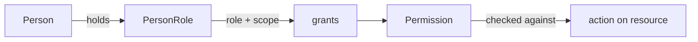

# Authorization

> Permission-based authorization, not hard-coded role checks. See R15, R1,
> `person-role-model.md`.

## Permission-based, not role-based checks

Code must **never** branch on role names:

```ts
// FORBIDDEN
if (person.role === "organizer") { ... }

// REQUIRED
if (can(person, "competition.event.create", scope)) { ... }
```

A `Permission` is a scoped capability. Whether a Person holds a permission is
resolved by evaluating their `PersonRole` entries against a permission
catalog. This decouples "what can be done" from "which role name does it."

## Permission model



A `Permission` is a string namespaced by context, e.g.:

| Permission | Granted by role (typical) | Scope |
|---|---|---|
| `competition.event.create` | organizer | organization |
| `competition.event.score` | official | event |
| `registration.submit` | athlete / team_manager | event |
| `registration.verify` | organizer / official | event |
| `rewards.issuance.verify` | official / system | event / global |
| `identity.sportsid.issue` | platform admin | global |
| `credentials.qr.rotate` | person (self) / guardian | person |
| `commerce.payment.refund` | organizer / admin | organization |

The catalog is illustrative, not exhaustive. The point is that each permission
maps to one or more (role, scope) combinations, evaluated at runtime.

## Scope evaluation

A permission check takes `(person, permission, scope)`:

1. Load the Person's `PersonRole` entries.
2. For each role, consult the permission catalog: does this role grant this
   permission?
3. Does the role's scope cover the target scope? (e.g. an `organizer` role
   scoped to Organization A permits `competition.event.create` for events
   under Org A, not Org B.)
4. Return allow/deny.

## Guardian scope

A `guardian` role scoped to a minor Person grants permissions to act on behalf
of that minor (submit registrations, pay, manage credentials). The scope is a
Person, not an Organization. Guardian permissions are a distinct scope kind.

## Identity verification gating

Some permissions require a minimum `IdentityVerificationLevel`:

- `identity.sportsid.issue` requires `verified`.
- `credentials.permanent_qr.issue` requires `verified`.
- `competition.event.score` may require `document` (configurable).

This composes with role/scope: the Person must both hold the role/scope **and**
meet the verification level. See `qr-credentials-model.md`.

## Enforcement layer

Authorization is enforced in the **application layer** (use cases), not in the
UI only. The UI hides/disables actions for usability, but every use case
re-checks permission before mutating. This prevents client-side bypass.

## Port: AuthorizationService

A future `AuthorizationService` port (in `src/ports/` or `src/app/`) will
encapsulate `can(person, permission, scope)`. It reads `PersonRole` and
`IdentityVerification` via repository ports. Not built this sprint beyond the
type definitions.

## Multi-tenancy interaction

Permissions are evaluated within a tenant. A role scoped to Organization A in
Tenant PH grants nothing in Tenant SG. See `tenancy.md`.

## Audit

Permission grants, revocations, and denied authorization attempts are
auditable (R16-style). See `audit-integrity.md`.
