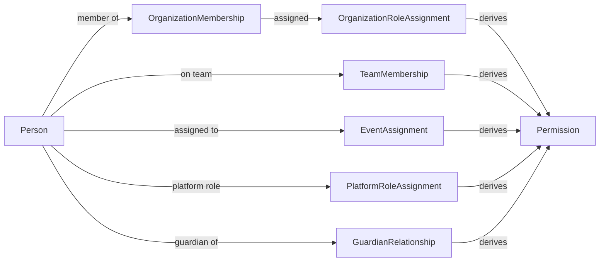

# Authorization

> Permission-based authorization derived from scoped memberships and
> assignments, not hard-coded role checks. See R15, R1, R25, R26,
> `person-role-model.md`, ADR-012.

## Permission-based, not role-based checks

Code must **never** branch on role names:

```ts
// FORBIDDEN
if (person.role === "organizer") { ... }

// REQUIRED
if (can(person, "competition.event.create", scope)) { ... }
```

A `Permission` is a scoped capability string. Whether a Person holds a
permission is resolved by evaluating their memberships and assignments
against a permission catalog.

## [C] Corrected permission model

Sprint 0 evaluated permissions against a flat `PersonRole` aggregate. Sprint
0.1 derives permissions from scoped memberships and assignments:



## Permission sources

| Source | Example permissions derived | Scope |
|---|---|---|
| `PlatformRoleAssignment` | `platform.tenant.manage`, `platform.user.view` | Platform |
| `OrganizationMembership` + `OrganizationRoleAssignment` | `competition.event.create`, `commerce.payment.refund` | Organization |
| `TeamMembership` | `team.roster.view`, `registration.submit` (as team) | Team |
| `EventAssignment` | `competition.event.score`, `result.confirm` | Event |
| `GuardianRelationship` | `registration.submit` (for minor), `credentials.qr.manage` (for minor) | Person |

Illustrative permission catalog:

| Permission | Derived from | Scope |
|---|---|---|
| `competition.event.create` | OrganizationRoleAssignment (organizer) | Organization |
| `competition.event.score` | EventAssignment (official/scorer) | Event |
| `registration.submit` | TeamMembership or AthleteProfile + GuardianRelationship | Event/Team/Person |
| `registration.verify` | OrganizationRoleAssignment (organizer/official) or EventAssignment | Event/Organization |
| `rewards.issuance.verify` | EventAssignment (official) or system | Event |
| `identity.sportsid.issue` | PlatformRoleAssignment (platform_admin) | Platform |
| `credentials.qr.rotate` | Person (self) or GuardianRelationship | Person |
| `commerce.payment.refund` | OrganizationRoleAssignment (organizer/staff) | Organization |

The catalog is illustrative, not exhaustive. Each permission maps to one or
more membership/assignment sources, evaluated at runtime.

## Scope evaluation

A permission check takes `(person, permission, scope)`:

1. Load the Person's relevant memberships/assignments for the target scope
   kind.
2. Consult the permission catalog: does this membership/assignment derive
   this permission?
3. Does the membership/assignment's scope cover the target scope? (e.g. an
   `OrganizationRoleAssignment` for Organization A permits
   `competition.event.create` for events under Org A, not Org B.)
4. Return allow/deny.

## Guardian scope

A `GuardianRelationship` scoped to a minor Person grants permissions to act
on behalf of that minor (submit registrations, pay, manage credentials). The
scope is a Person, not an Organization. Guardian permissions are a distinct
scope kind (`PermissionScope.kind: "person"`).

## Identity verification gating

Some permissions require a minimum `IdentityVerificationLevel`:

- `identity.sportsid.issue` requires `verified`.
- `credentials.permanent_qr.issue` requires `verified`.
- `competition.event.score` may require `document` (configurable).

This composes with membership/scope: the Person must both hold the
membership/assignment **and** meet the verification level. See
`qr-credentials-model.md`.

## Enforcement layer

Authorization is enforced in the **application layer** (use cases), not in the
UI only. The UI hides/disables actions for usability, but every use case
re-checks permission before mutating. This prevents client-side bypass.

## Port: AuthorizationService

A future `AuthorizationService` (owned by the application layer) will
encapsulate `can(person, permission, scope)`. It reads memberships,
assignments, and `IdentityVerification` via repository/query ports. Not built
this sprint beyond the type definitions.

## Multi-tenancy interaction

Permissions are evaluated within a tenant for organization/tenant-owned and
event-scoped resources. An `OrganizationRoleAssignment` in Tenant PH grants
nothing in Tenant SG. Platform-global permissions (from
`PlatformRoleAssignment`) may span tenants under strict audit. See
`tenancy.md`.

## Audit

Membership grants/revocations, assignment changes, and denied authorization
attempts are auditable. See `audit-integrity.md`.
