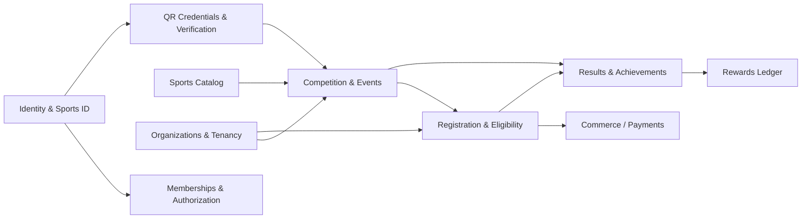

# Bounded Contexts

> SportsOS is decomposed into bounded contexts aligned to the product vision.
> Each context owns its aggregates, value objects, and domain events.
>
> **[C] Sprint 0.1 correction:** Contexts do NOT communicate only through
> EventBus. Cross-context interaction may use published application contracts,
> synchronous query/service ports, domain/integration events, and immutable
> shared identifiers. See `dependency-rules.md`, ADR-017.

## Context map

Arrows denote "collaborates with." Contexts may interact via events
(asynchronous) or synchronous query/service ports, chosen per consistency
requirement. No context imports another context's domain internals directly.

## Contexts

### 1. Identity & Sports ID

**Owns:** `Person`, `SportsId`, `AthleteProfile`, minor/guardian relationship,
identity lifecycle (active/deactivated/archived/anonymized).
**Ownership classification [C]:** Person and SportsId are platform-global.
AthleteProfile is person-owned.
**Responsibility:** the permanent, platform-issued identity that survives
account lifecycle changes. Issues Sports IDs. Manages AthleteProfile creation
(optional, at most one per Person). Never deletes a Person's historical
identity. See `identity-model.md`, ADR-002, ADR-010, ADR-011.

### 2. Memberships & Authorization

**Owns:** `PlatformRoleAssignment`, `OrganizationMembership`,
`OrganizationRoleAssignment`, `TeamMembership`, `EventAssignment`,
`GuardianRelationship`, `Permission`, `PermissionScope`.
**Ownership classification [C]:** Memberships/assignments are organization/tenant-owned
or event-scoped. Platform role assignments are platform-global.
**Responsibility:** manages scoped memberships and assignments, derives
permissions, evaluates `can(person, permission, scope)`. Permission-based,
not role-name based. See `person-role-model.md`, `authorization.md`, ADR-012.

### 3. Sports Catalog

**Owns:** `Sport`, `Discipline`, `CompetitionMeasure`.
**Ownership classification [C]:** Reference data (platform-global, no tenantId).
**Responsibility:** the canonical catalog of sports, disciplines, and how they
are measured/scored. Reference data; slow-changing. A future controlled
customization model may allow tenant-specific extensions. See `sports-model.md`,
ADR-010.

### 4. Organizations & Tenancy

**Owns:** `Tenant`, `Organization`, `Team`.
**Ownership classification [C]:** Organization/tenant-owned.
**Responsibility:** the isolation boundary (Tenant) and the structured bodies
(clubs, schools, associations, LGUs, governing bodies, sponsors, venue
operators). Teams are competing units that belong to organizations. See
`organization-model.md`, `tenancy.md`, ADR-004, ADR-010.

### 5. Competition & Events

**Owns:** `CompetitionEvent`, `Competition`, `Division`, `Stage`, `Contest`
(future), `EventFormat`, participant abstraction.
**Ownership classification [C]:** Event-scoped (tenant-owned).
**Responsibility:** defining and running competitions across all formats.
Independent aggregate lifecycles at each level (Event → Competition →
Division → Stage → Contest) to avoid unbounded aggregates at national scale.
See `competition-model.md`, ADR-005, ADR-013.

### 6. Registration & Eligibility

**Owns:** `Registration`, eligibility rules, check-in (future).
**Ownership classification [C]:** Event-scoped (tenant-owned).
**Responsibility:** entering a participant into an event, verifying
eligibility, and separating the **participant** from the **payer**. See
`registration-model.md`, ADR-008.

### 7. Commerce / Payments

**Owns:** `RegistrationCharge`, `Order`, `PaymentAttempt`,
`PaymentTransaction`, `Refund`, `Settlement`, `OrganizerPayout`, `Money`.
**Ownership classification [C]:** Organization/tenant-owned + historical/audit.
**Responsibility:** money movement, append-only financial records,
multi-currency. Multiple payment attempts per order. Decoupled from
registration domain logic via events and/or synchronous service ports. See
`commerce-model.md`, ADR-008, ADR-014.

### 8. Results & Achievements

**Owns:** `CompetitionResult`, `Achievement`, result immutability.
**Ownership classification [C]:** Historical/audit.
**Responsibility:** recording confirmed competition outcomes and deriving
verifiable achievements. Append-only; amendments never overwrite. References
`AthleteProfile` (person-owned) and `Competition` (event-scoped). See
`results-achievements-model.md`.

### 9. Rewards Ledger

**Owns:** `RewardsLedgerEntry`, derived `RewardsBalance`,
`RewardSourceIdentity`, verification/fraud controls.
**Ownership classification [C]:** Historical/audit.
**Responsibility:** Sports Points accounting. The ledger is the source of
truth; balances are projections. Idempotent issuance, reversal/adjustment
entries, duplicate-award prevention. See `rewards-model.md`, ADR-006, ADR-015.

### 10. QR Credentials & Verification

**Owns:** `QrCredential`, `IdentityVerification`.
**Ownership classification [C]:** Permanent QR credentials are person-owned;
event credentials are event-scoped (tenant-owned). IdentityVerification is
person-owned.
**Responsibility:** issuing, rotating, and revoking QR credentials with full
lifecycle (issued/active/expired/revoked/replaced/compromised), and tracking
identity verification levels. SportsId and QrCredential are separate. See
`qr-credentials-model.md`, ADR-007.

## [C] Entity ownership classification matrix

| Entity | Owning context | Ownership classification | Has `tenantId`? |
|---|---|---|---|
| Person | Identity | Platform-global | No |
| SportsId | Identity | Platform-global | No |
| AthleteProfile | Identity | Person-owned | No |
| PlatformRoleAssignment | Auth | Platform-global | No |
| OrganizationMembership | Auth | Organization/tenant-owned | Yes |
| OrganizationRoleAssignment | Auth | Organization/tenant-owned | Yes |
| TeamMembership | Auth | Event-scoped | Yes |
| EventAssignment | Auth | Event-scoped | Yes |
| GuardianRelationship | Auth | Person-owned | No |
| Sport, Discipline | Sports Catalog | Reference data | No |
| Tenant, Organization, Team | Orgs & Tenancy | Organization/tenant-owned | Yes |
| CompetitionEvent | Competition | Event-scoped | Yes |
| Competition, Division, Stage, Contest | Competition | Event-scoped | Yes |
| Registration | Registration | Event-scoped | Yes |
| RegistrationCharge, Order, PaymentAttempt | Commerce | Organization/tenant-owned | Yes |
| PaymentTransaction, Refund, Settlement, OrganizerPayout | Commerce | Historical/audit | Yes |
| CompetitionResult, Achievement | Results | Historical/audit | Yes |
| RewardsLedgerEntry, RewardsBalance | Rewards | Historical/audit | Yes |
| QrCredential (permanent) | Credentials | Person-owned | No |
| QrCredential (event) | Credentials | Event-scoped | Yes |
| IdentityVerification | Credentials | Person-owned | No |

## [C] Revised aggregate candidates

- **Person** aggregate (Identity) — root: `Person`; includes `SportsId`. Platform-global.
- **AthleteProfile** aggregate (Identity) — root: `AthleteProfile`; person-owned, optional.
- **PlatformRoleAssignment** aggregate (Auth) — root: `PlatformRoleAssignment`.
- **OrganizationMembership** aggregate (Auth) — root: `OrganizationMembership`; includes role assignments.
- **TeamMembership** aggregate (Auth) — root: `TeamMembership`.
- **EventAssignment** aggregate (Auth) — root: `EventAssignment`.
- **GuardianRelationship** aggregate (Auth) — root: `GuardianRelationship`.
- **Organization** aggregate (Orgs) — root: `Organization`.
- **Team** aggregate (Orgs) — root: `Team`.
- **CompetitionEvent** aggregate (Competition) — root: `CompetitionEvent`; independent (no child aggregates).
- **Competition** aggregate (Competition) — root: `Competition`; independent, references Event by ID.
- **Division** aggregate (Competition) — root: `Division`; independent, references Competition by ID.
- **Stage** aggregate (Competition) — root: `Stage`; independent, references Division by ID.
- **Contest** aggregate (Competition, future) — root: `Contest`; independent, references Stage by ID.
- **Registration** aggregate (Registration) — root: `Registration`.
- **Order** aggregate (Commerce) — root: `Order`; references charges.
- **PaymentAttempt** aggregate (Commerce) — root: `PaymentAttempt`.
- **PaymentTransaction** (Commerce) — immutable record, append-only.
- **CompetitionResult** aggregate (Results) — root: `CompetitionResult`; immutable.
- **Achievement** aggregate (Results) — root: `Achievement`.
- **RewardsLedger** per-athlete (Rewards) — append-only.
- **QrCredential** aggregate (Credentials) — root: `QrCredential`.

## [C] Cross-context communication

Contexts do NOT directly depend on another context's repositories or domain
internals. They may interact via:

1. **Published application contracts** — well-defined interfaces (query/service
   ports) owned by the application layer, allowing one context to query
   another for read-only data when synchronous consistency is needed.
2. **Synchronous query/service ports** — for when the caller needs an
   immediate consistent answer (e.g. Registration querying Commerce for an
   Order's payment status).
3. **Domain/integration events** — for asynchronous, eventual-consistency
   communication (e.g. `ResultConfirmed` → Rewards considers issuance).
4. **Immutable shared identifiers** — typed IDs from the shared kernel
   (`Id<"Person">`, `Id<"Event">`, etc.). Contexts reference each other by ID,
   never by importing another context's aggregate state.

**Synchronous vs asynchronous** is chosen per consistency requirement:
synchronous when the caller needs an immediate consistent answer, asynchronous
when eventual consistency is acceptable. See `dependency-rules.md`, ADR-017.
