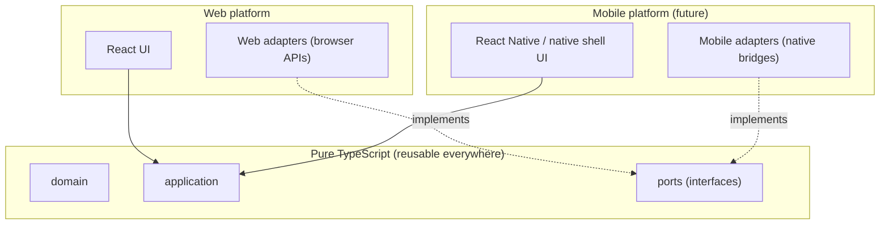

# Client Platforms

> Web/mobile platform boundary. See ADR-009, R21, R22, `mobile-strategy.md`.

## Platform boundary principle

The **domain** and **application** layers are pure TypeScript with zero
platform dependencies. Platform-specific concerns live in **adapters** that
implement ports. This is what makes the same core logic reusable on web now
and on Android/iOS later (R21, R22).

## Web (this sprint)

- React + Vite + TypeScript + Tailwind CSS.
- Mobile-first responsive design: mobile browsers, tablets, desktop.
- Browser APIs (camera via getUserMedia, Web Share, Web Notifications, localStorage)
  are accessed **only** through adapters implementing the native capability
  ports — never directly from domain/application code.
- No PWA functionality this sprint (no service worker, no install prompt,
  no offline cache strategy). The architecture allows it later.

## Mobile (future, not built)

Two viable distribution paths, both compatible with this architecture:

1. **React Native shell** reusing the TypeScript domain/application layer and
   ports, with React Native adapters for native capabilities.
2. **WebView shell** (Capacitor-style) wrapping the web app, with a native
   bridge adapter exposing device capabilities through the same ports.

Either way, the domain/application layers and port interfaces are unchanged.
Only adapters and the presentation shell differ. See `mobile-strategy.md`.

## Native capability ports

Defined in `src/app/contracts/platform/native-ports.ts` [S2]:

| Port | Web adapter (future) | Mobile adapter (future) |
|---|---|---|
| `CameraPort` | getUserMedia | native camera |
| `QrScannerPort` | Web QR library / BarcodeDetector | native QR scanner |
| `PushNotificationPort` | Web Notifications + push | FCM/APNs |
| `SecureCredentialStoragePort` | localStorage / WebCrypto | Keystore / Keychain |
| `BiometricsPort` | (limited / WebAuthn) | Face ID / fingerprint |
| `FileUploadPort` | file input | native picker |
| `DeepLinkPort` | URL routing | app deep links |
| `SharePort` | Web Share API | native share sheet |
| `LocationPort` | Geolocation API | native location |
| `OfflineSyncPort` | IndexedDB queue | native background sync |

The ports are defined now to prove the seam exists. Adapters are stubs this
sprint.

## What the UI may and may not import

- Presentation (`src/*.tsx`, future `src/app/**`) may import React, ports
  (via injected adapters), and application services.
- Presentation may **not** import domain aggregates directly for mutation; it
  goes through application services.
- Presentation may **not** import adapter implementations directly; it
  receives them via dependency injection.

## Responsive design requirement

Mobile-first. Breakpoints for tablet and desktop. Touch-first interactions.
The architecture sprint does not build product screens, but the Tailwind
config and viewport meta are set up to support this from Sprint 1.
