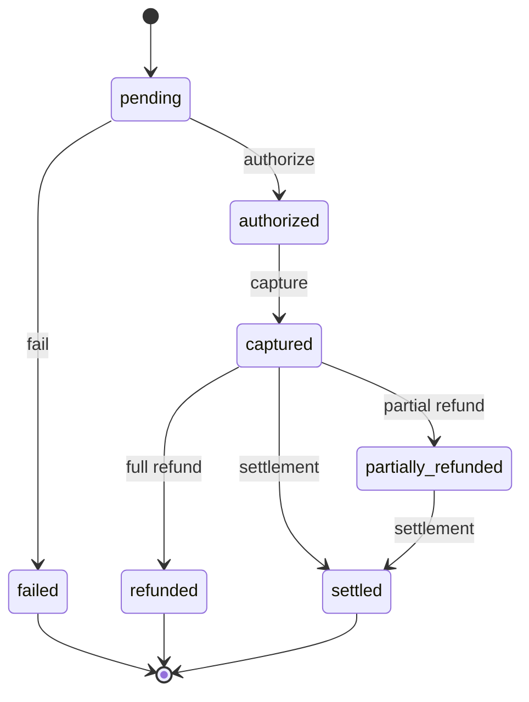

# Commerce Model

> Payment / commerce boundary, multi-currency, and append-only financial audit.
> See ADR-008, R13, R16.

## Commerce boundary

The Commerce context owns **money movement**. It does not own registrations,
participants, or results. It links to them by typed ID only. This isolation
means payment providers (Stripe, GCash, Maya, bank transfers) are swappable
adapters behind a payment gateway port (R24).

```typescript
interface Payment {
  id: Id<"Payment">;
  tenantId: Id<"Tenant">;
  payerPersonId: Id<"Person">;
  registrationId: Id<"Registration"> | null;
  amount: Money;
  status: PaymentStatus;
  providerRef: string | null;
  capturedAt: ISODateString | null;
}

type PaymentStatus =
  | "pending" | "authorized" | "captured"
  | "failed" | "refunded" | "partially_refunded" | "settled";
```

## Money is multi-currency (R13)

`Money` carries an ISO 4217 currency code and an integer amount in **minor
units** (centavos for PHP, cents for USD). No hard-coded PHP. No floating
point.

```typescript
interface Money {
  amountMinorUnits: number;
  currency: CurrencyCode; // ISO 4217, branded string
}
```

All money arithmetic and display goes through a Money value object that
respects currency precision. The platform may price entry fees in PHP today
and USD/EUR tomorrow without schema change.

## Append-only financial ledger (R16)

Every charge, refund, settlement, and adjustment produces a
`PaymentLedgerEntry`. The ledger is **append-only**: entries are never
mutated or deleted. A refund is a new entry, not a modification of the
original charge.

```typescript
interface PaymentLedgerEntry {
  id: Id<"PaymentLedgerEntry">;
  paymentId: Id<"Payment">;
  entryType: "charge" | "refund" | "settlement" | "adjustment";
  amount: Money;
  recordedAt: ISODateString;
}
```

The current `Payment.status` is a **projection** of the ledger, recomputable
from it. This mirrors the rewards ledger pattern (R7) and guarantees
auditability.

## Payment lifecycle



Each transition appends a `PaymentLedgerEntry` and publishes a domain event
(`PaymentCaptured`, `PaymentRefunded`, `PaymentSettled`). Other contexts
(Registration, Rewards reconciliation) react to events, never to direct calls.

## Refunds and settlements

- **Refund** — returns money to the payer. Creates a `refund` ledger entry.
  May be partial. Does not delete the original charge.
- **Settlement** — the platform's reconciliation with the payment provider /
  organizer payout. Creates a `settlement` ledger entry. Settlement is a
  future workflow; the ledger shape supports it now.

## Participant vs payer (recap)

The `payerPersonId` on a Payment matches the `payerPersonId` on the linked
Registration (R18). A payment is owed by a Person, not by an Athlete or Team.
This keeps minor/guardian and sponsor payment flows clean.

## Port: PaymentGateway

A future `PaymentGatewayPort` (in `src/ports/`) will abstract provider
interactions (authorize, capture, refund, webhook handling). Webhook signature
verification happens in the adapter, not in the domain. Not built this sprint.

## What is NOT in Commerce

- Entry fee pricing rules (future, may live in Competition or a Pricing
  context, referenced by Registration).
- Reward marketplace purchases (future Rewards context consumer).
- Payouts to organizers (future settlement workflow).
