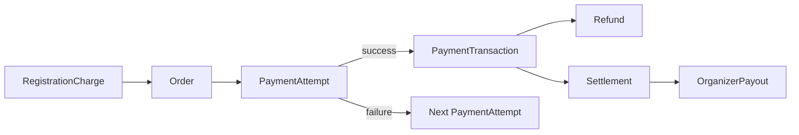

# Commerce Model

> Commerce boundary, multi-currency, append-only financial audit, and the
> conceptual separation of commerce concepts. See ADR-008, ADR-014, R13, R16.

## [C] Corrected commerce model

Sprint 0 modeled commerce as one `Payment` aggregate with embedded
`PaymentLedgerEntry` history. Sprint 0.1 separates commerce into distinct
concepts to support: multiple payment attempts for one order, independent
refund/settlement/payout lifecycles, and clear auditability.



## Conceptual separation

| Concept | What it is | Mutability |
|---|---|---|
| `RegistrationCharge` | A charge line item arising from a Registration | Mutable (while Order open) |
| `Order` | A commercial obligation for a payer, aggregating charges | Status transitions |
| `PaymentAttempt` | A single attempt to pay an Order | Status transitions |
| `PaymentTransaction` | The captured money movement from a successful attempt | **Append-only / immutable** |
| `Refund` | A reversal of a PaymentTransaction | **Append-only** |
| `Settlement` | Platform reconciliation with a payment provider for a batch | **Append-only** |
| `OrganizerPayout` | Platform payout to an organizer | **Append-only** |

### RegistrationCharge

A charge line item arising from a `Registration`. Owned by Commerce but
references `Registration` by typed ID.

```typescript
interface RegistrationCharge {
  id: Id<"RegistrationCharge">;
  tenantId: Id<"Tenant">;
  registrationId: Id<"Registration">;
  amount: Money;
  description: string;
}
```

### Order

A commercial obligation aggregating one or more `RegistrationCharge`s for a
payer. The payer is a `Person`, independent of the competition participant (R18).

```typescript
interface Order {
  id: Id<"Order">;
  tenantId: Id<"Tenant">;
  payerPersonId: Id<"Person">;
  chargeIds: ReadonlyArray<Id<"RegistrationCharge">>;
  totalAmount: Money;
  status: "open" | "partially_paid" | "paid" | "refunded" | "voided";
}
```

### PaymentAttempt

A single attempt to pay an Order. **Multiple attempts may exist for one
Order** (e.g. a failed card retry, then a successful GCash payment).

```typescript
interface PaymentAttempt {
  id: Id<"PaymentAttempt">;
  tenantId: Id<"Tenant">;
  orderId: Id<"Order">;
  amount: Money;
  status: "initiated" | "authorized" | "captured" | "failed" | "cancelled";
  providerRef: string | null;
  attemptNumber: number;
}
```

### PaymentTransaction

The captured/settled money movement from a successful PaymentAttempt.
**Immutable** — this is the permanent financial record.

```typescript
interface PaymentTransaction {
  id: Id<"PaymentTransaction">;
  tenantId: Id<"Tenant">;
  attemptId: Id<"PaymentAttempt">;
  orderId: Id<"Order">;
  amount: Money;
  capturedAt: ISODateString;
}
```

### Refund

A reversal of a PaymentTransaction. Append-only. May be partial. The original
transaction is never mutated.

```typescript
interface Refund {
  id: Id<"Refund">;
  tenantId: Id<"Tenant">;
  transactionId: Id<"PaymentTransaction">;
  amount: Money;
  recordedAt: ISODateString;
}
```

### Settlement

The platform's reconciliation with a payment provider for a batch of
transactions. Append-only. Future workflow; the shape is defined now.

```typescript
interface Settlement {
  id: Id<"Settlement">;
  tenantId: Id<"Tenant">;
  transactionIds: ReadonlyArray<Id<"PaymentTransaction">>;
  totalAmount: Money;
  settledAt: ISODateString;
}
```

### OrganizerPayout

The platform's payout to an organizer. Append-only. Future workflow.

```typescript
interface OrganizerPayout {
  id: Id<"OrganizerPayout">;
  tenantId: Id<"Tenant">;
  organizationId: Id<"Organization">;
  settlementIds: ReadonlyArray<Id<"Settlement">>;
  amount: Money;
  paidOutAt: ISODateString;
}
```

## Money is multi-currency (R13)

`Money` carries an ISO 4217 currency code and an integer amount in **minor
units** (centavos for PHP, cents for USD). No hard-coded PHP. No floating
point.

```typescript
interface Money {
  amountMinorUnits: number;
  currency: CurrencyCode; // ISO 4217, branded string
}
```

## Append-only financial records (R16)

`PaymentTransaction`, `Refund`, `Settlement`, and `OrganizerPayout` are
**append-only**: they are never mutated or deleted. An `Order`'s current
status is a **projection** of its transactions, refunds, and settlements.
Financial reconciliation replays the append-only records.

## Payer independence (R18)

The `payerPersonId` on an Order is a Person, independent of the competition
participant. A guardian may pay for a minor athlete; a sponsor representative
may pay for a team. This keeps minor/guardian and sponsor payment flows clean.

## Commerce ↔ Registration interaction

Commerce and Registration communicate via events and/or synchronous service
ports (see `dependency-rules.md`, ADR-017):

- **Asynchronous (events):** `RegistrationSubmitted` → Commerce creates a
  `RegistrationCharge` and `Order`; `PaymentTransactionCaptured` → Registration
  advances status.
- **Synchronous (query port):** Registration may query Commerce for the
  payment status of an Order when it needs an immediate answer.

The choice depends on consistency requirements: synchronous when the caller
needs an immediate consistent answer, asynchronous when eventual consistency
is acceptable.

## Port: PaymentGateway

A future `PaymentGatewayPort` (in `src/app/contracts/`, application-owned) will
abstract provider interactions (authorize, capture, refund, webhook handling).
Webhook signature verification happens in the adapter, not in the domain. Not
built this sprint.

## What is NOT in Commerce

- Entry fee pricing rules (future, may live in Competition or a Pricing
  context, referenced by Registration).
- Reward marketplace purchases (future Rewards context consumer).
- Payout calculation rules (future settlement workflow).
