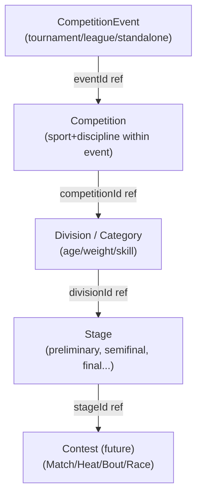

# Competition Model

> Competition aggregate boundaries, participant abstraction, team vs individual,
> and format extensibility. See ADR-005, ADR-013.

## [C] Re-evaluated aggregate boundaries

Sprint 0 modeled `EventContainer` containing `CompetitionEvent` children as a
single aggregate. Sprint 0.1 corrects this: a national-scale event (e.g. Palarong
Pambansa) contains many sports, divisions, competitions, matches/heats/bouts/
races, and thousands of participants. An aggregate containing all of these
would be unbounded, causing performance and concurrency problems.

Each level is an **independent aggregate** with its own lifecycle, referencing
its parent by typed ID. This allows concurrent operations on different
competitions/divisions/stages without lock contention.



## Hierarchy

### CompetitionEvent (aggregate root)

The top-level organized occurrence — a tournament, league, or standalone event.
Organized by an Organization. Tenant-owned (event-scoped).

```typescript
interface CompetitionEvent {
  id: Id<"Event">;
  tenantId: Id<"Tenant">;
  kind: "tournament" | "league" | "standalone";
  name: string;
  organizerOrganizationId: Id<"Organization">;
}
```

### Competition (independent aggregate, references Event by ID)

A specific sport/discipline competition within an Event. Carries the format
and participant kind. Tenant-owned (event-scoped).

```typescript
interface Competition {
  id: Id<"Competition">;
  tenantId: Id<"Tenant">;
  eventId: Id<"Event">;
  sportId: Id<"Sport">;
  disciplineId: Id<"Discipline"> | null;
  format: EventFormat;
  participantKind: "individual" | "team";
  measure: CompetitionMeasure;
}
```

### Division / Category (independent aggregate)

An age group, weight class, skill level, or other partitioning within a
Competition. Tenant-owned (event-scoped).

```typescript
interface Division {
  id: Id<"Division">;
  tenantId: Id<"Tenant">;
  competitionId: Id<"Competition">;
  name: string;
  label: string;
}
```

### Stage (independent aggregate)

A phase within a Division's competition structure (preliminary, semifinal,
final, etc.). Tenant-owned (event-scoped).

```typescript
interface Stage {
  id: Id<"Stage">;
  tenantId: Id<"Tenant">;
  divisionId: Id<"Division">;
  kind: StageKind;
  name: string;
  sequence: number;
}
```

### Contest (future aggregate, seam defined)

A single match/heat/bout/race within a Stage. Its concrete shape is
discriminated by `ContestKind`. Forward-looking — not implemented this sprint.
No competition engines are built (per sprint brief).

```typescript
interface Contest {
  id: Id<"Contest">;
  tenantId: Id<"Tenant">;
  stageId: Id<"Stage">;
  contestKind: ContestKind;
}
```

## Participant abstraction

A participant in a competition is either an **individual** (an AthleteProfile)
or a **team** (a Team). The `participantKind` discriminates which. Downstream
contexts (Registration, Results) use this discriminator to know what
`participantId` refers to.

```typescript
type ParticipantKind = "individual" | "team";
// participantId: Id<"AthleteProfile"> | Id<"Team"> — discriminated by participantKind
```

## Team vs individual competition

The same competition framework handles both. The `participantKind` field is
the switch:

- **individual** — `participantId` is an `AthleteProfile`. Results record
  per-athlete outcomes (time, distance, score, placement, judged total).
- **team** — `participantId` is a `Team`. Results record per-team outcomes.
  Team composition (which athletes are on the team for this event) is modeled
  via `TeamMembership` in the authorization context.

## Competition format extensibility

`EventFormat` is an extensible enum. Initial formats:

| `EventFormat` | Typical `measure` |
|---|---|
| `single_elimination` | head_to_head / score |
| `double_elimination` | head_to_head / score |
| `round_robin` | score / placement |
| `swiss` | score |
| `timed_finals` | timed |
| `measured_final` | measured_distance / measured_score |
| `judged` | judged |
| `group_then_knockout` | score / head_to_head |

Adding a new format is a non-breaking addition. **The format is data, not a
code branch in another context** — Results and Registration treat format
opaquely. Bracket/draw structure per format is a future concern within the
Competition context's Stage/Contest aggregates.

## Multi-participant events

Some events involve many simultaneous participants (a road race, a swimming
heat). These are handled by `placement` / `timed` measures where a single
competition yields many results (one per participant). The Results context
owns batch result recording; see `results-achievements-model.md`.

## Scoring and results (boundary)

Scoring and results belong to the **Results & Achievements** context, not
Competition. Competition owns the **structure** (events, competitions,
divisions, stages, contests); Results owns the **outcomes**. Competition
publishes/integrates with Results when a stage or contest is finalized. This
separation keeps results immutable and auditable independently of structure
mutations. See `results-achievements-model.md`.

## Check-in (future)

Event check-in is a future flow at the boundary of Competition and
Registration. It is not built this sprint. The `OfflineSyncPort` is reserved
to support offline check-in (see `offline-resilience.md`).
