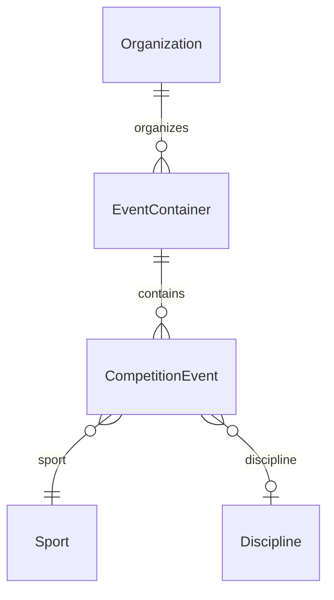

# Competition Model

> Event vs Tournament vs League, participant abstraction, team vs individual,
> and format extensibility. See ADR-005.

## Event vs Tournament vs League

- **EventContainer** — a container that holds one or more competition events.
  Kinds: `tournament`, `league`, `standalone`.
- **CompetitionEvent** — a single unit of competition within a container,
  with a format and a participant kind.



| Container kind | Example |
|---|---|
| `tournament` | "Quezon City Open 2026" — contains singles, doubles, team events |
| `league` | "Metro Basketball League Season 4" — contains scheduled matches |
| `standalone` | a single one-off event |

```typescript
interface EventContainer {
  id: Id<"EventContainer">;
  tenantId: Id<"Tenant">;
  kind: "tournament" | "league" | "standalone";
  name: string;
  organizerOrganizationId: Id<"Organization">;
}

interface CompetitionEvent {
  id: Id<"Event">;
  tenantId: Id<"Tenant">;
  containerId: Id<"EventContainer">;
  sportId: Id<"Sport">;
  disciplineId: Id<"Discipline"> | null;
  format: EventFormat;
  participantKind: "individual" | "team";
  measure: CompetitionMeasure;
}
```

## Participant abstraction

A participant in a competition is either an **individual** (an Athlete) or a
**team** (a Team). The `participantKind` discriminates which. Downstream
contexts (Registration, Results) use this discriminator to know what
`participantId` refers to.

```typescript
type ParticipantKind = "individual" | "team";
// participantId: Id<"Athlete"> | Id<"Team"> — discriminated by participantKind
```

## Team vs individual competition

The same competition framework handles both. The `participantKind` field is
the switch:

- **individual** — `participantId` is an `Athlete`. Results record per-athlete
  outcomes (time, distance, score, placement, judged total).
- **team** — `participantId` is a `Team`. Results record per-team outcomes.
  Team composition (which athletes are on the team for this event) is a future
  aggregate owned by the Competition context.

This lets a tournament contain both individual and team events under one
container without special casing.

## Competition format extensibility

`EventFormat` is an extensible enum. Initial formats:

| `EventFormat` | Typical `measure` |
|---|---|
| `single_elimination` | head_to_head / score |
| `double_elimination` | head_to_head / score |
| `round_robin` | score / placement |
| `swiss` | score |
| `timed_finals` | timed |
| `measured_final` | measured_distance / measured_score |
| `judged` | judged |
| `group_then_knockout` | score / head_to_head |

Adding a new format (e.g. `ladder`, `league_playoffs`) is a non-breaking
addition. The bracket/draw structure for each format is a future aggregate
within the Competition context; it is not modeled this sprint. The important
architectural property is that **the format is data, not a code branch in
another context** — Results and Registration treat format opaquely.

## Multi-participant events

Some events involve many simultaneous participants (a road race, a swimming
heat). These are handled by `placement` / `timed` measures where a single
event yields many results (one per participant). The Results context owns
batch result recording; see `results-achievements-model.md`.

## Scoring and results (boundary)

Scoring and results belong to the **Results & Achievements** context, not
Competition. Competition owns the **structure** (containers, events, draws);
Results owns the **outcomes**. Competition publishes `EventFinalized` when an
event's structure is closed; Results records the outcomes. This separation
keeps results immutable and auditable independently of bracket mutations.

## Check-in (future)

Event check-in is a future flow at the boundary of Competition and
Registration. It is not built this sprint. The `OfflineSyncPort` is reserved
to support offline check-in (see `offline-resilience.md`).
