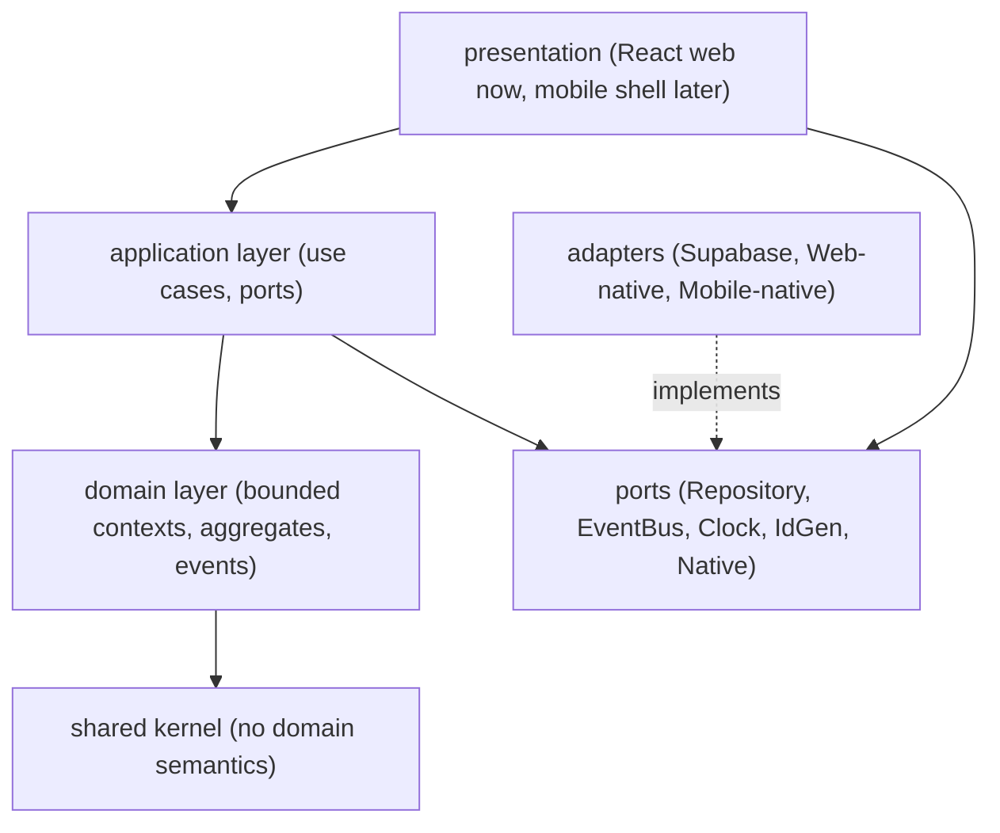

# Dependency Rules

> Strict dependency boundaries for SportsOS. These rules are the backbone of
> infrastructure independence (R24) and web/mobile reuse (R21).
>
> **[C] Sprint 0.1 corrections:** Domain must NOT depend on ports. Application
> owns ports. Cross-context interaction is not limited to EventBus. See
> ADR-016, ADR-017.

## Layer model



**Key correction [C]:** Domain no longer depends on Ports. The domain layer
contains business model and invariants only. The application layer owns
orchestration and external capability contracts (ports). Native platform ports
remain outside Domain.

## Allowed dependency direction

| From → To | Allowed? |
|---|---|
| Presentation → Application | ✅ |
| Presentation → Ports | ✅ (for native capabilities via injected adapters) |
| Application → Domain | ✅ |
| Application → Ports | ✅ |
| Application → Shared | ✅ (transitively) |
| Domain → Shared | ✅ |
| Domain → Ports | ❌ **[C] corrected** — domain must not depend on ports |
| Domain → Application | ❌ |
| Domain → Adapters | ❌ |
| Domain → Presentation | ❌ |
| Domain → any platform SDK | ❌ |
| Application → Adapters | ❌ (only via ports) |
| Application → any platform SDK | ❌ |
| Adapters → Ports | ✅ (implements) |
| Adapters → Domain | ✅ (to persist domain entities) |
| Adapters → any platform SDK | ✅ (this is the only place) |
| Ports → Shared | ✅ (ports reference shared kernel types) |
| Ports → Domain | ✅ (ports may reference domain types for repository contracts) |
| Shared → anything | ❌ (shared kernel depends on nothing) |

## Hard prohibitions

1. **No `@adapters` import from `@domain` or `@app`.** The domain and
   application layers must not know which infrastructure is in use.
2. **No `@ports` import from `@domain`** [C]. The domain layer must not
   depend on ports (Repository, EventBus, Clock, IdGenerator, or native
   capability ports). The domain produces events and entities; the
   application layer handles delivery and persistence.
3. **No platform SDK import from `@domain` or `@app`.** This includes React,
   React Native, `window`, `document`, Supabase client, Stripe SDK, Node-only
   modules, etc. The domain/application layers are pure TypeScript.
4. **No cross-context domain internal imports.** A bounded context may not
   import another context's internal aggregates. It may reference typed IDs
   from the shared kernel and interact via published application contracts,
   synchronous service ports, or events (see below).
5. **No cycles.** Enforced by ESLint `import/no-cycle`.

## [C] Cross-context communication strategy (corrected)

Sprint 0 required all cross-context communication to use EventBus. Sprint 0.1
replaces this with a more nuanced rule:

**Bounded-context domain internals must not directly depend on another
context's repositories or domain internals.** Cross-context interaction may
use:

1. **Published application contracts** — well-defined interfaces (query/service
   ports) owned by the application layer.
2. **Synchronous query/service ports** — for immediate-consistency reads
   (e.g. Registration querying Commerce for an Order's payment status).
3. **Domain/integration events** — for asynchronous, eventual-consistency
   communication (e.g. `ResultConfirmed` → Rewards considers issuance).
4. **Immutable shared identifiers** — typed IDs from the shared kernel.

**Choose synchronous vs asynchronous according to consistency requirements:**

| Requirement | Mechanism | Example |
|---|---|---|
| Immediate consistent answer needed | Synchronous query port | Registration asks Commerce: "is Order X paid?" |
| Eventual consistency acceptable | Domain event | Results publishes `ResultConfirmed`; Rewards reacts |
| Cross-context reference only | Shared typed ID | Registration stores `Id<"Event">` without loading the Event aggregate |
| Read model projection | Integration event | Results publishes events; a projector updates a Statistics read model |

Example: when Results confirms a result, it publishes `ResultConfirmed`. The
Rewards context subscribes (asynchronous) and decides whether to issue Sports
Points. Results never calls `rewardsRepository.issue(...)`. Conversely, if
Registration needs to know whether an Order is paid before allowing
withdrawal, it calls a synchronous `OrderQueryPort` owned by Commerce's
application layer.

## [C] Port ownership (corrected)

| Port | Owner | Notes |
|---|---|---|
| `Repository<T,B>` | Application | Persists/retrieves domain entities. Domain defines what needs persisting; application owns the contract. |
| `EventBus` | Application | Routes domain events. Domain produces events; application handles delivery. |
| `Clock` | Application | Provides current time. Domain receives timestamps as values. |
| `IdGenerator` | Application | Generates unique IDs. Domain receives IDs as values. |
| `CameraPort`, `QrScannerPort`, etc. | Application | Native platform ports. Owned by application, NOT domain. Implemented by adapters. |

Ports live in `src/ports/` and are owned by the **application** layer.
Adapters in `src/adapters/` implement them. This inverts the dependency so
the domain never depends on infrastructure (Dependency Inversion Principle).

## Enforcement

| Mechanism | Status |
|---|---|
| TypeScript path aliases (`@domain`, `@app`, `@ports`, `@adapters`, `@shared`) | ✅ in place |
| ESLint `import/no-cycle` | ✅ in place |
| ESLint `import/no-unresolved` via TS resolver | ✅ in place |
| `eslint-plugin-boundaries` / `dependency-cruiser` layer rules | **Backlog — Sprint 1** [C] |
| Code review checklist | ✅ (see `architecture-rules.md` Enforcement) |

## [C] Sprint 1 machine-enforced boundaries (planned)

Sprint 1 will add automated boundary enforcement (ADR-018):

1. **`dependency-cruiser`** rules to enforce:
   - `@domain` may only import from `@shared` and other `@domain` files.
   - `@app` may import from `@domain`, `@ports`, `@shared`.
   - `@adapters` may import from `@ports`, `@domain`, `@shared`, platform SDKs.
   - No cross-context `@domain` internal imports.
2. **`eslint-plugin-boundaries`** as an alternative if dependency-cruiser is
   not adopted.
3. A CI gate that fails the build on boundary violations.

This documentation is created now (ADR-018); the implementation is Sprint 1.

## Package layout (this sprint)

```
src/
  shared/        # shared kernel (Id, Brand, Result, ISODateString)
  domain/        # bounded contexts (type definitions only this sprint)
    identity/        # Person, SportsId, AthleteProfile, memberships, assignments
    organization/    # Organization, Team
    sports/          # Sport, Discipline, AthleteSportParticipation
    competition/     # CompetitionEvent, Competition, Division, Stage, Contest
    registration/    # Registration
    commerce/        # RegistrationCharge, Order, PaymentAttempt, PaymentTransaction, Refund, Settlement, OrganizerPayout
    results/         # CompetitionResult, Achievement
    rewards/         # RewardsLedgerEntry, RewardsBalance
    credentials/     # QrCredential, IdentityVerification
  ports/         # APPLICATION-owned interfaces (Repository, EventBus, Clock, IdGen, Native)
  adapters/      # infrastructure implementations (stubs this sprint)
  app/           # application layer (reserved for Sprint 1)
  main.tsx, App.tsx, index.css  # presentation shell
```

Only the minimum structure to express boundaries exists. No application
services, no repository implementations, no database schema — by design.
