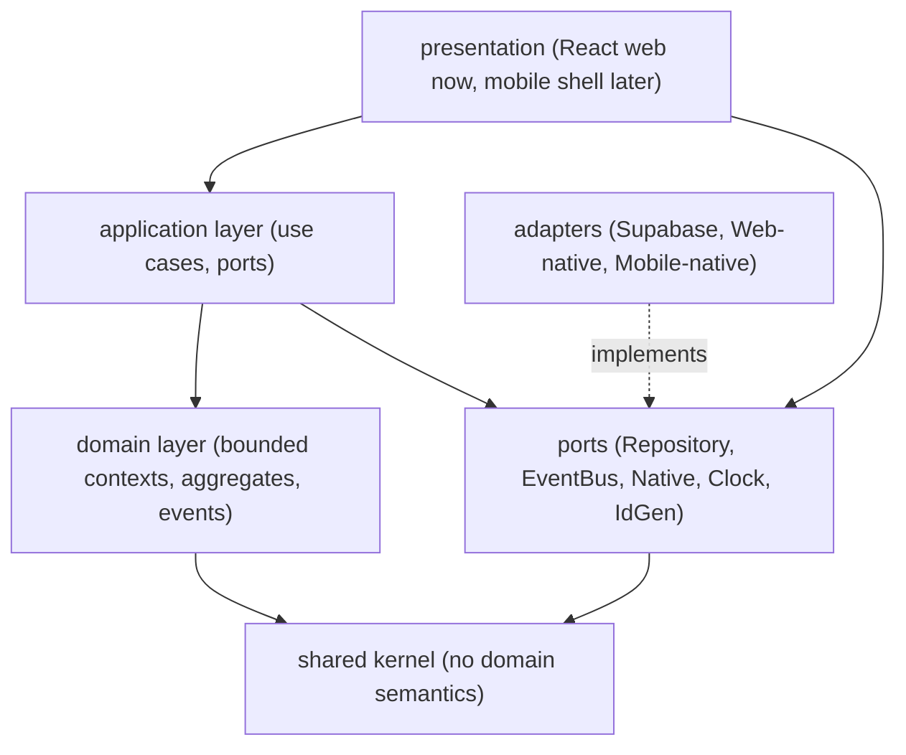

# Dependency Rules

> Strict dependency boundaries for SportsOS. These rules are the backbone of
> infrastructure independence (invariant 24) and web/mobile reuse
> (invariant 21).

## Layer model



## Allowed dependency direction

| From → To | Allowed? |
|---|---|
| Presentation → Application | ✅ |
| Presentation → Ports | ✅ (for native capabilities via injected adapters) |
| Application → Domain | ✅ |
| Application → Ports | ✅ |
| Application → Shared | ✅ (transitively) |
| Domain → Shared | ✅ |
| Domain → Ports | ✅ (aggregates publish events via EventBus port interface) |
| Domain → Application | ❌ |
| Domain → Adapters | ❌ |
| Domain → Presentation | ❌ |
| Domain → any platform SDK | ❌ |
| Application → Adapters | ❌ (only via ports) |
| Application → any platform SDK | ❌ |
| Adapters → Ports | ✅ (implements) |
| Adapters → Domain | ✅ (to persist domain entities) |
| Adapters → any platform SDK | ✅ (this is the only place) |
| Ports → anything inward | ✅ (ports are interfaces; they reference shared kernel types only) |
| Shared → anything | ❌ (shared kernel depends on nothing) |

## Hard prohibitions

1. **No `@adapters` import from `@domain` or `@app`.** The domain and
   application layers must not know which infrastructure is in use.
2. **No platform SDK import from `@domain` or `@app`.** This includes React,
   React Native, `window`, `document`, Supabase client, Stripe SDK, Node-only
   modules, etc. The domain/application layers are pure TypeScript.
3. **No cross-context internal imports.** A bounded context may not import
   another context's internal aggregates. It may only reference typed IDs from
   the shared kernel and react to domain events via the `EventBus`.
4. **No cycles.** Enforced by ESLint `import/no-cycle`.

## Cross-context communication strategy

Contexts communicate **only** through:

1. **Domain events** on the `EventBus` port. Producers publish; consumers
   subscribe by event type. No direct repository calls across contexts.
2. **Shared typed identifiers** (`Id<"Person">`, `Id<"Event">`, …) from the
   shared kernel. A context stores another context's entity ID as a reference
   but never loads that entity directly.

Example: when Results confirms a result, it publishes `ResultConfirmed`. The
Rewards context subscribes and decides whether to issue Sports Points. Results
never calls `rewardsRepository.issue(...)`.

## Port ownership

Ports are **owned by the application/domain layer** and live in `src/ports/`.
Adapters in `src/adapters/` implement them. This inverts the dependency so the
domain never depends on infrastructure (Dependency Inversion Principle).

## Enforcement

| Mechanism | Status |
|---|---|
| TypeScript path aliases (`@domain`, `@app`, `@ports`, `@adapters`, `@shared`) | ✅ in place |
| ESLint `import/no-cycle` | ✅ in place |
| ESLint `import/no-unresolved` via TS resolver | ✅ in place |
| `eslint-plugin-boundaries` / `dependency-cruiser` layer rules | Backlog — recommended for Sprint 1 |
| Code review checklist | ✅ (see `architecture-rules.md` Enforcement) |

## Package layout (this sprint)

```
src/
  shared/        # shared kernel (Id, Brand, Result, ISODateString)
  domain/        # bounded contexts (type definitions only this sprint)
    identity/
    organization/
    sports/
    competition/
    registration/
    commerce/
    results/
    rewards/
    credentials/
  ports/         # interfaces the application needs (Repository, EventBus, Native)
  adapters/      # infrastructure implementations (stubs this sprint)
  app/           # application layer (reserved for Sprint 1)
  main.tsx, App.tsx, index.css  # presentation shell
```

Only the minimum structure to express boundaries exists. No application
services, no repositories implementations, no database schema — by design.
