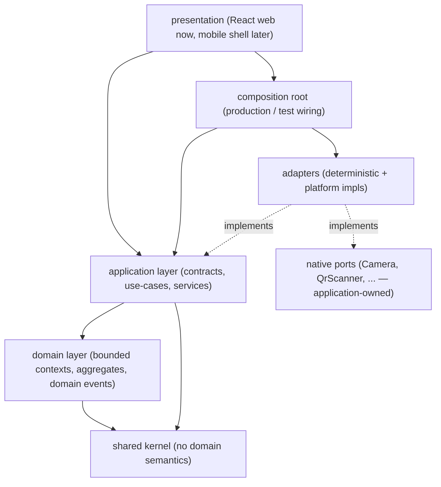

# Dependency Rules

> Strict dependency boundaries for SportsOS. These rules are the backbone of
> infrastructure independence (R24) and web/mobile reuse (R21).
>
> **[C] Sprint 0.1 corrections:** Domain must NOT depend on ports. Application
> owns its capability contracts. Cross-context interaction is not limited to an
> event bus. See ADR-016, ADR-017.
>
> **[S1] Sprint 1:** These boundaries are now **machine-enforced** with
> `dependency-cruiser` (`npm run architecture:check`, ADR-018). Application
> capability contracts moved into `src/app/contracts/`; the generic
> `Repository` and `EventBus` interfaces were removed (see clarifications 4 and
> the event contract). A composition root (`src/composition/`) wires adapters.

## Layer model



**Key point:** the domain layer depends only on the shared kernel. The
application layer owns the capability contracts (`Clock`, `IdGenerator`,
`EventPublisher`, `UseCase`) the domain needs but must not implement. Adapters
implement those contracts. The composition root is the only place adapters and
application code are wired together.

## Allowed dependency direction

| From → To | Allowed? |
|---|---|
| Presentation → Application | ✅ |
| Presentation → Composition | ✅ (to obtain a wired container) |
| Presentation → Adapters | ❌ (reach infrastructure via composition) |
| Composition → Application | ✅ |
| Composition → Adapters | ✅ (this is where wiring happens) |
| Application → Domain | ✅ |
| Application → Shared | ✅ |
| Application → Adapters | ❌ (only via contracts, wired in composition) |
| Application → Composition | ❌ |
| Application → any platform SDK | ❌ |
| Domain → Shared | ✅ |
| Domain → Application / Ports / Adapters / Composition | ❌ |
| Domain → Presentation | ❌ |
| Domain → any platform SDK (npm) | ❌ |
| Adapters → Application contracts | ✅ (implements) |
| Adapters → Domain / Shared | ✅ (to build/persist domain values) |
| Adapters → Presentation / Composition | ❌ |
| Adapters → any platform SDK | ✅ (this is the only place) |
| Shared → anything | ❌ (shared kernel depends on nothing) |

## Hard prohibitions

1. **No `@adapters` import from `@domain` or `@app`.** The domain and
   application layers must not know which infrastructure is in use.
2. **No `@ports`/`@app`/`@adapters` import from `@domain`.** The domain layer
   produces events and entities; the application layer handles delivery and
   persistence.
3. **No platform SDK import from `@domain` or `@app`.** This includes React,
   React Native, `window`, `document`, Supabase client, Stripe SDK, etc. The
   domain/application layers are pure TypeScript.
4. **No cross-context domain internal imports at runtime.** A bounded context
   may not import another context's internals at runtime. Type-only references
   are permitted (types erase at build time and create no runtime coupling).
5. **No cycles.**

## Cross-context communication strategy

Bounded-context domain internals must not directly depend on another context's
repositories or domain internals. Cross-context interaction may use:

1. **Published application contracts** — query/service ports owned by the
   application layer.
2. **Synchronous query/service ports** — for immediate-consistency reads.
3. **Domain/integration events** — for asynchronous, eventual-consistency
   communication. A `DomainEvent` is an internal fact; an `IntegrationEvent`
   (defined in `src/app/contracts/events.ts`) is the versioned cross-boundary
   contract. See `application-foundation.md`.
4. **Immutable shared identifiers** — typed IDs from the shared kernel.

Choose synchronous vs asynchronous per consistency requirement.

## Capability contract ownership

| Contract | Owner | Location |
|---|---|---|
| `UseCase<Input, Output>` | Application | `src/app/contracts/use-case.ts` |
| Application `Result` / `AppError` | Application | `src/app/contracts/result.ts` |
| `Clock` | Application | `src/app/contracts/clock.ts` |
| `IdGenerator` | Application | `src/app/contracts/id-generator.ts` |
| `EventPublisher`, `IntegrationEvent` | Application | `src/app/contracts/events.ts` |
| `DomainEvent` | Domain | `src/domain/aggregate.ts` |
| `CameraPort`, `QrScannerPort`, etc. | Application | `src/ports/native-ports.ts` |

Adapters in `src/adapters/` implement these contracts. This inverts the
dependency so the domain never depends on infrastructure.

**No generic repository abstraction exists.** Persistence contracts are defined
per bounded context / use-case when a slice needs them, so each aggregate keeps
the query/mutation shape it actually requires rather than a forced uniform CRUD
surface (clarification 4, ADR-016).

## Machine-enforced boundaries [S1]

Enforcement is automated with `dependency-cruiser`
(`.dependency-cruiser.cjs`). Run independently with:

```
npm run architecture:check
```

Rules of `error` severity fail the check (non-zero exit). Enforced rules:

| Rule | Meaning |
|---|---|
| `no-circular` | No dependency cycles. |
| `domain-no-app` / `-ports` / `-adapters` / `-composition` / `-presentation` | Domain imports none of these layers. |
| `domain-no-external-sdk` | Domain imports no npm package (React, browser, DB, payment SDKs). |
| `no-cross-context-runtime` | A domain context may not import another context's internals at runtime (type-only allowed). |
| `app-no-adapters` / `-composition` / `-presentation` | Application imports no adapters, wiring, or UI. |
| `app-no-external-sdk` | Application imports no npm platform package. |
| `presentation-no-adapters` | Presentation reaches infrastructure via the composition root, not adapters directly. |
| `adapters-no-presentation-or-composition` | Adapters do not depend on UI or wiring. |

Alias resolution (`@domain`, `@app`, ...) is read from `tsconfig.app.json`;
`tsPreCompilationDeps` lets rules distinguish `import type` from runtime imports.

| Mechanism | Status |
|---|---|
| TypeScript path aliases | ✅ |
| `dependency-cruiser` layer + context rules | ✅ **[S1] implemented** |
| Architecture check in test suite | ✅ (`tests/architecture.test.ts`) |
| ESLint `import/no-cycle` (secondary guard) | ✅ |

## Package layout

```
src/
  shared/        # shared kernel (Id, Brand, Result, ISODateString)
  domain/        # bounded contexts (type definitions only) + aggregate.ts (DomainEvent)
  app/
    contracts/   # UseCase, Result/AppError, Clock, IdGenerator, EventPublisher, IntegrationEvent
    use-cases/   # per-context orchestration (added with vertical slices)
    services/    # application services (added with vertical slices)
  ports/         # native platform capability ports (application-owned)
  adapters/
    clock/       # SystemClock, FakeClock
    id/          # UuidIdGenerator, FakeIdGenerator
    events/      # InMemoryEventPublisher, NoopEventPublisher
  composition/   # container + production/test wiring (composition root)
  main.tsx, App.tsx, index.css  # presentation shell
tests/           # deterministic infra + architecture tests (outside src)
```

Only the minimum structure to express boundaries and support future vertical
slices exists. No product use-cases, no repository implementations, no database
schema — by design.
