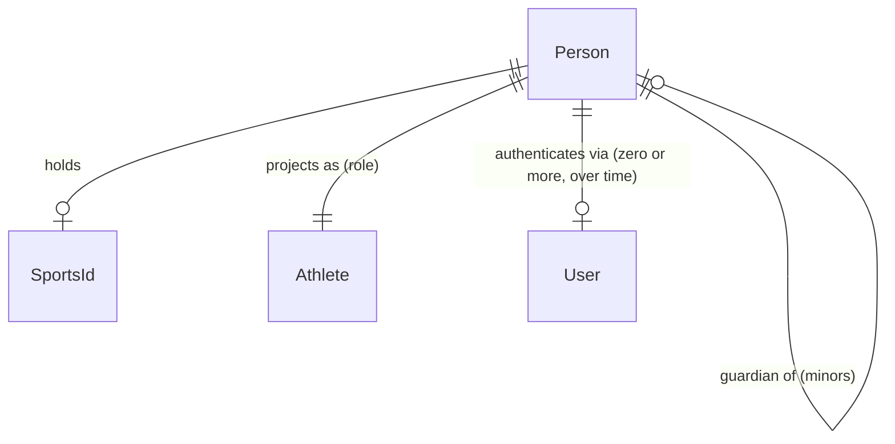

# Identity Model

> Defines `Person`, `User`, `Athlete`, and `SportsId`. See ADR-002 and
> `person-role-model.md`.

## Person vs User vs Athlete

These are three **distinct** concepts. Conflating them is the most common
modeling error in sports platforms and is explicitly forbidden here.

| Concept | What it is | Lifecycle | Identity |
|---|---|---|---|
| **Person** | The natural/legal human being. The permanent identity subject. | Survives account deletion (soft delete + archive). Holds the Sports ID forever. | `Id<"Person">` |
| **User** | An authentication subject — a credential holder that logs in. | Tied to an account; can be disabled, locked, recreated. May not exist for minors (a guardian's User acts on their behalf). | `Id<"User">` (future) |
| **Athlete** | A **role projection** of a Person into the sports competition domain. | One per Person. Sport-independent. | `Id<"Athlete">` |

Key rules:

- A **Person** has at most one **Sports ID** (R2). The Sports ID is permanent.
- A **Person** may have zero or more **Users** over time (e.g. password reset,
  re-registration). A User is never the source of identity; the Person is.
- A **Person** has **one** `Athlete` projection (R3). The Athlete participates
  in many sports (R4); it is not re-created per sport.
- A minor Person may have **no User** of their own; a guardian Person's User
  acts on their behalf (R19).



## Sports ID model

A `SportsId` is:

- **Permanent.** Once issued it is never reassigned to another Person.
- **Platform-issued.** Never chosen by the person. Generated by an
  `IdGenerator` port to avoid collisions.
- **Single.** A Person has at most one. Re-issuance (e.g. after a data
  corruption incident) is a privileged, audited operation that produces a new
  value and revokes the old, never duplicates.
- **Revocable** (`status: "revoked"`) but the revocation is recorded; the ID
  value is never reused.

```typescript
interface SportsId {
  value: Id<"SportsId">;
  issuedAt: string;
  status: "active" | "revoked";
}
```

## Minor / guardian relationships

A `Person` may carry a `guardianId` pointing to another `Person`. This supports:

- Guardian consent for minors.
- Guardian-as-payer for registrations (R18).
- Guardian-managed credentials for minors.

The relationship is modeled on Person, not on User, because identity (not
login) is what persists.

## Identity archive & deletion (R20)

"Deleting" an account is **soft**:

1. The User (authentication subject) is disabled.
2. Active QR credentials are revoked.
3. The Person record is retained in an immutable identity archive.
4. Historical results, achievements, and ledger entries are untouched.

This guarantees historical sports records never disappear because an account
was deleted. See `audit-integrity.md`.

## Sports Passport (future)

The athlete Sports Passport is a **derived view** over:
- the Person's identity,
- their Athlete projection,
- their `AthleteSportParticipation` entries,
- their verified `Achievement` records.

It is not a separate aggregate; it is a read model composed from multiple
contexts. No persistence for it is built this sprint.
