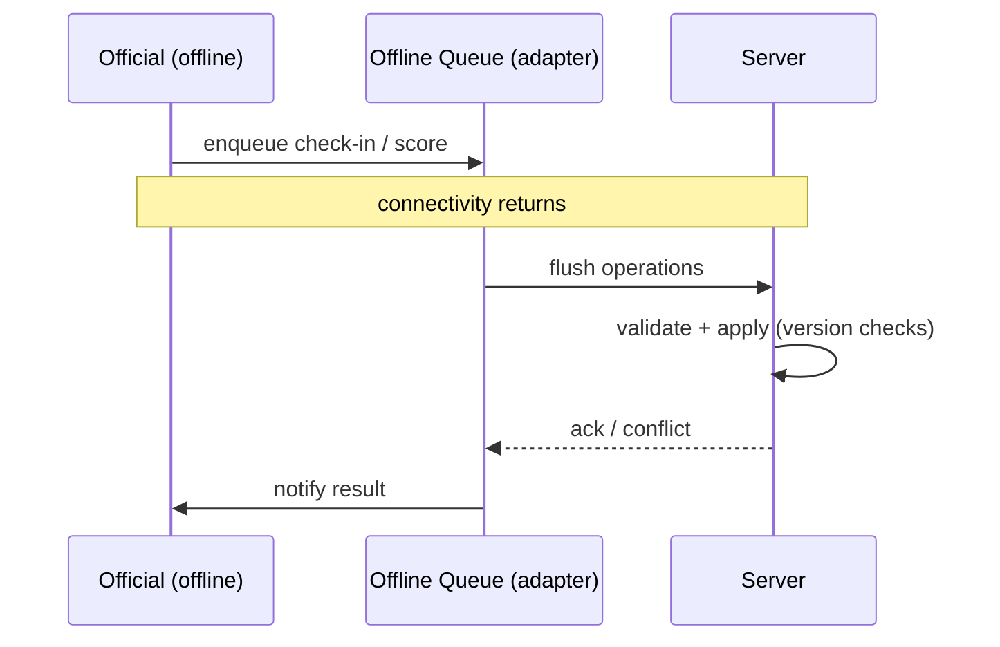

# Offline Resilience

> Future limited offline workflows for event operations. Not implemented this
> sprint. See R23.

## Goal (future)

Allow **limited offline workflows** for event operations — primarily event
check-in and match scoring — so that officials and organizers can operate
during connectivity gaps (common at venues with poor signal), syncing back
when online.

This sprint defines the **seam** (`OfflineSyncPort`) and the constraints. No
offline implementation is built (R23).

## Offline scope (future, limited)

Only event-operation workflows are candidates for offline:

- **Event check-in** — an official scans a QR credential offline, recording
  check-ins against a pre-downloaded roster.
- **Match scoring** — an official enters scores/placements offline against a
  pre-downloaded event structure.

Out of scope for offline:

- Payments (never offline — money movement requires online authorization).
- Registration creation (requires eligibility checks and payment).
- Rewards issuance (requires verification).
- Account creation / identity verification.

This "limited offline" boundary keeps integrity invariants intact: only
operations that can be safely reconciled later are allowed offline.

## OfflineSyncPort seam

```typescript
interface OfflineSyncPort {
  enqueue(operation: QueuedOperation): Promise<void>;
  flush(): Promise<void>;
}

interface QueuedOperation {
  id: string;
  type: string;
  payload: unknown;
}
```

The contract is defined in `src/app/contracts/platform/native-ports.ts` [S2]. Future adapters:

- **Web** — IndexedDB queue + background sync (when PWA is built).
- **Mobile** — native persistent queue + background sync / work manager.

The application layer enqueues operations when offline; the adapter persists
them and flushes when connectivity returns. Conflicts are resolved
server-side with optimistic concurrency (version checks).

## Reconciliation model (future)



Server-side reconciliation is authoritative. Offline operations are treated
as **provisional** until confirmed. This mirrors the `provisional → confirmed`
result lifecycle (see `results-achievements-model.md`): offline scores land as
`provisional` and are confirmed by a verification step.

## Constraints preserved offline

- **Tenant isolation** — offline operations carry `tenantId`; server rejects
  cross-tenant operations on flush.
- **Authorization** — the official's role/scope is checked at enqueue time
  (against cached role data) **and** re-checked server-side on flush. Server
  is authoritative.
- **Immutability** — offline scores become `provisional` results; they follow
  the same append-only amendment rules.
- **Audit** — flushed operations produce the same audit events as online ones.

## What is NOT built this sprint

- No offline queue implementation.
- No conflict resolution logic.
- No pre-download of rosters/event structures.
- No PWA service worker or cache strategy.
- No native background sync.

The `OfflineSyncPort` interface exists to prove the architecture allows this
future capability without core changes.
