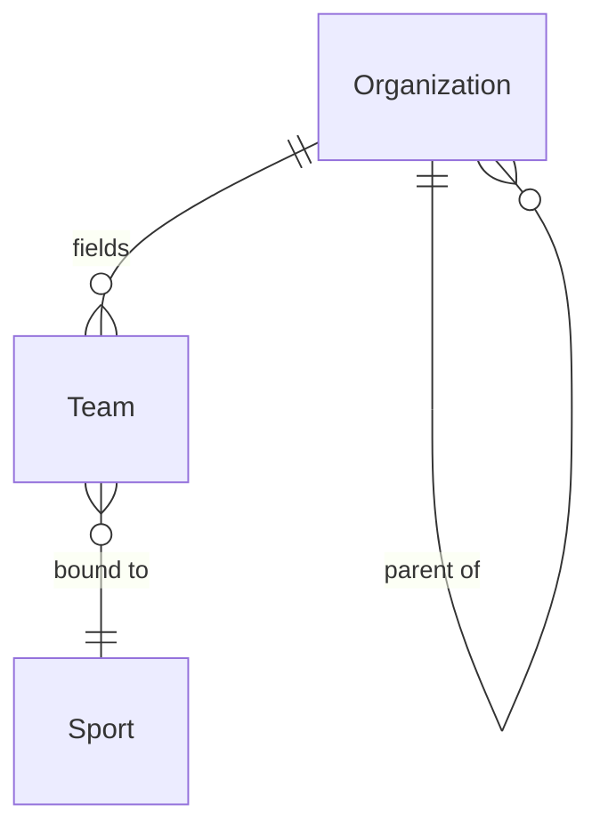

# Organization Model

> Team vs Organization, and the tenancy boundary. See ADR-004, `tenancy.md`.

## Organization

An `Organization` is any structured body that owns or governs sport activity.
It is discriminated by `kind`:

| `kind` | Examples |
|---|---|
| `club` | local sports clubs |
| `school` | elementary, secondary, universities |
| `association` | sport associations |
| `lgu` | local government units (cities, municipalities, provinces) |
| `governing_body` | national sport associations, federations |
| `sponsor` | commercial sponsors |
| `venue_operator` | venue owners/operators |

Organizations can form hierarchies (`parentId`): an association may have
member clubs; a governing body may have member associations. The hierarchy is
within a tenant.

```typescript
interface Organization {
  id: Id<"Organization">;
  tenantId: Id<"Tenant">;
  kind: OrganizationKind;
  legalName: string;
  parentId: Id<"Organization"> | null;
}
```

## Team vs Organization

A **Team** is a **competing unit**, not a legal body. A Team belongs to an
Organization but is not the Organization.

| | Organization | Team |
|---|---|---|
| What it is | Legal/structural body | Competing unit |
| Owns teams? | Yes | No |
| Competes? | No (it fields teams) | Yes |
| Sport-bound? | No | Yes (`sportId`) |
| Examples | "Quezon City Basketball Club" | "QCBC - U16 Team A" |

```typescript
interface Team {
  id: Id<"Team">;
  tenantId: Id<"Tenant">;
  organizationId: Id<"Organization">;
  name: string;
  sportId: Id<"Sport">;
}
```

An Organization may field many Teams across many sports. A Team belongs to one
Organization and is bound to one Sport (a multi-sport club creates one Team
per sport).



## Tenancy (summary)

A **Tenant** is the isolation boundary. Every tenant-scoped entity carries
`tenantId`. Multi-tenancy is explicit (R14). See `tenancy.md` for the full
model, including the relationship between Tenant and Organization and
cross-tenant access rules.

## Organization membership

Persons hold roles **within** organizations (e.g. `coach` scoped to
Organization A). Organization membership is expressed through scoped
`PersonRole` entries, not a separate membership table in this sprint. A future
membership aggregate may formalize this.

## Organizers

An "organizer" is a **role** (`RoleKind: "organizer"`) scoped to an
Organization. The organization that owns an `EventContainer` is recorded as
`organizerOrganizationId`. This separates the legal body (Organization) from
the people acting on its behalf (Persons with the organizer role).

## Sponsors and venue operators

Sponsors and venue operators are modeled as Organizations of the corresponding
`kind`. This avoids inventing parallel hierarchies and lets the tenancy and
membership model apply uniformly. Sponsorship deals and venue bookings are
future aggregates that reference Organizations.
