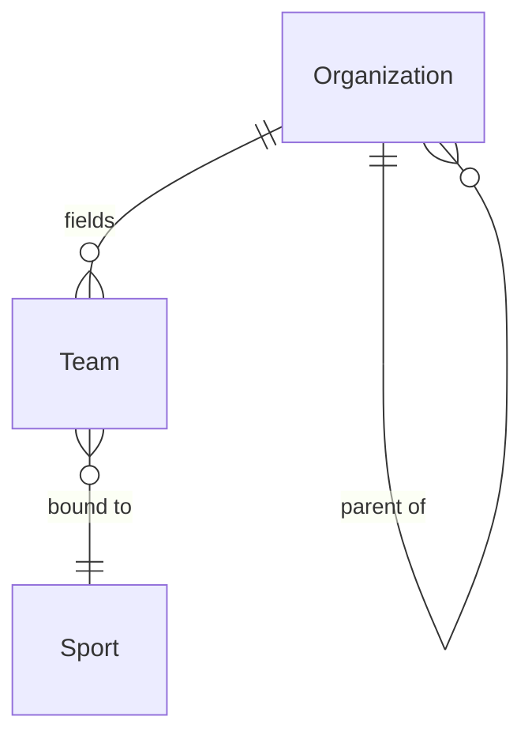

# Organization Model

> Team vs Organization, and the tenancy boundary. See ADR-004, ADR-010,
> `tenancy.md`.

## Organization

An `Organization` is any structured body that owns or governns sport activity.
It is discriminated by `kind`:

| `kind` | Examples |
|---|---|
| `club` | local sports clubs |
| `school` | elementary, secondary, universities |
| `association` | sport associations |
| `lgu` | local government units (cities, municipalities, provinces) |
| `governing_body` | national sport associations, federations |
| `sponsor` | commercial sponsors |
| `venue_operator` | venue owners/operators |

Organizations can form hierarchies (`parentId`): an association may have
member clubs; a governing body may have member associations. The hierarchy is
within a tenant.

**Ownership: organization/tenant-owned** [C]. See `tenancy.md`.

```typescript
interface Organization {
  id: Id<"Organization">;
  tenantId: Id<"Tenant">;
  kind: OrganizationKind;
  legalName: string;
  parentId: Id<"Organization"> | null;
}
```

## Team vs Organization

A **Team** is a **competing unit**, not a legal body. A Team belongs to an
Organization but is not the Organization.

| | Organization | Team |
|---|---|---|
| What it is | Legal/structural body | Competing unit |
| Owns teams? | Yes | No |
| Competes? | No (it fields teams) | Yes |
| Sport-bound? | No | Yes (`sportId`) |
| Examples | "Quezon City Basketball Club" | "QCBC - U16 Team A" |
| Ownership [C] | Organization/tenant-owned | Organization/tenant-owned |

```typescript
interface Team {
  id: Id<"Team">;
  tenantId: Id<"Tenant">;
  organizationId: Id<"Organization">;
  name: string;
  sportId: Id<"Sport">;
}
```

An Organization may field many Teams across many sports. A Team belongs to one
Organization and is bound to one Sport (a multi-sport club creates one Team
per sport).



## [C] Organization membership (corrected)

Persons hold roles within organizations through separate aggregates (see
`person-role-model.md`, ADR-012):

- `OrganizationMembership` — a Person belongs to an Organization.
- `OrganizationRoleAssignment` — a Person holds a role (organizer, official,
  coach, team_manager, staff, sponsor_representative) within that membership.

This replaces the Sprint 0 model where membership was expressed through a
single `PersonRole` entry. The separation allows independent lifecycles and
more precise permission derivation.

## Tenancy (summary)

A **Tenant** is the isolation boundary for organization/tenant-owned and
event-scoped data. Organizations and Teams carry `tenantId`. Platform-global
entities (Person, SportsId, Sport, Discipline) and person-owned entities
(AthleteProfile) do NOT [C]. See `tenancy.md` for the full ownership
classification.

## Organizers

An "organizer" is an `OrganizationRoleKind` assigned via
`OrganizationRoleAssignment` within an `OrganizationMembership`. The
organization that owns an Event is recorded as `organizerOrganizationId` on
the `CompetitionEvent`. This separates the legal body (Organization) from the
people acting on its behalf.

## Sponsors and venue operators

Sponsors and venue operators are modeled as Organizations of the corresponding
`kind`. This avoids inventing parallel hierarchies and lets the tenancy and
membership model apply uniformly. Sponsorship deals and venue bookings are
future aggregates that reference Organizations. A `sponsor_representative`
role kind exists for persons acting on behalf of a sponsor organization.
