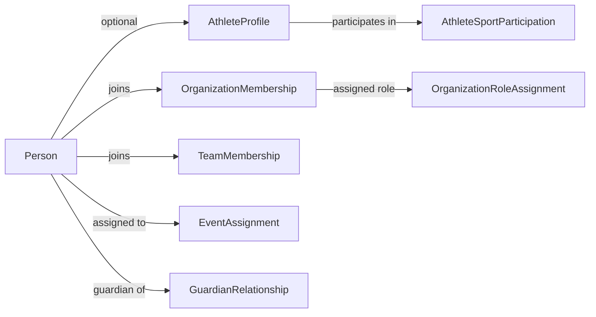

# Person-Role Model

> One Person, many roles — but roles are derived from scoped memberships and
> assignments, not a single flat PersonRole aggregate.
> See ADR-002, ADR-012, `authorization.md`, R1, R15.

## [C] Corrected model

Sprint 0 had a single `PersonRole` aggregate binding a Person to a `RoleKind`
within a `RoleScope`. Sprint 0.1 re-evaluates this: authorization is derived
from **scoped memberships and assignments**, not permanent global person roles.
The `PersonRole` aggregate is replaced by separate concepts:

| Concept | What it represents | Scope |
|---|---|---|
| `PlatformRoleAssignment` | Platform-level admin/support capabilities | Platform |
| `OrganizationMembership` | A Person belongs to an Organization | Organization |
| `OrganizationRoleAssignment` | A Person holds a role within an org (organizer, official, coach, team_manager, staff, sponsor_representative) | Organization |
| `TeamMembership` | A Person/AthleteProfile is on a Team | Team |
| `EventAssignment` | A Person is assigned to an Event in a capacity (official, scorer, marshal, timekeeper, judge) | Event |
| `GuardianRelationship` | A Person is guardian of a minor Person | Person |

```typescript
// Platform-level
interface PlatformRoleAssignment {
  id: Id<"PlatformRoleAssignment">;
  personId: Id<"Person">;
  role: "platform_admin" | "platform_support";
}

// Organization-level
interface OrganizationMembership {
  id: Id<"OrganizationMembership">;
  personId: Id<"Person">;
  organizationId: Id<"Organization">;
  tenantId: Id<"Tenant">;
}

interface OrganizationRoleAssignment {
  id: Id<"OrganizationRoleAssignment">;
  membershipId: Id<"OrganizationMembership">;
  role: OrganizationRoleKind;
}

// Team-level
interface TeamMembership {
  id: Id<"TeamMembership">;
  personId: Id<"Person">;
  athleteProfileId: Id<"AthleteProfile"> | null;
  teamId: Id<"Team">;
  tenantId: Id<"Tenant">;
}

// Event-level
interface EventAssignment {
  id: Id<"EventAssignment">;
  personId: Id<"Person">;
  eventId: Id<"Event">;
  tenantId: Id<"Tenant">;
  capacity: EventAssignmentCapacity;
}
```

## Why separate aggregates instead of one PersonRole?

1. **Different lifecycles.** A membership persists for years; an event
   assignment lasts for one event. Mixing them in one aggregate creates
   awkward add/remove semantics.
2. **Different concurrency.** Event assignments change frequently during an
   event; org memberships change rarely. Separate aggregates avoid lock
   contention.
3. **Permissions derive from memberships, not from a flat role list.** An
   `organizer` permission is derived from an `OrganizationRoleAssignment`
   within an `OrganizationMembership`. This is more precise than "Person has
   organizer role."
4. **No hard-coded role authorization.** The permission catalog maps
   memberships/assignments to permissions. Adding a new role kind is a new
   assignment type, not a change to a central role enum.

## AthleteProfile vs athlete participation

Becoming an athlete is a two-step concept:

1. **AthleteProfile creation** — a Person optionally gets an AthleteProfile
   (sport-independent, person-owned). This is the enduring sporting identity.
2. **AthleteSportParticipation** — the AthleteProfile links to specific sports.
3. **TeamMembership** — a Person/AthleteProfile joins a Team (organization-scoped).

A Person may be a coach (`OrganizationRoleAssignment`) without ever having an
AthleteProfile. A Person may be a guardian (`GuardianRelationship`) without
any org membership. These are independent.



## Guardian relationship

The `GuardianRelationship` is a separate concept from org membership. It is
scoped to a Person (the minor), not to an Organization. It grants permissions
to act on behalf of the minor (registrations, payments, credential management).
[S3] The relationship is modelled solely as a `GuardianRelationship` between two
Persons; it is NOT a field on `Person` (no `guardianId`). See ADR-019.

## Multi-role invariants

1. Memberships/assignments are **grant and revoke** — never hard-coded checks
   on role names.
2. Every assignment is **scoped** (platform, organization, team, event, person).
3. Role evaluation is **permission-based** (R15). Code checks `can(person,
   permission, scope)`, never `person.role === "organizer"`. See
   `authorization.md`.
4. Granting/revoking memberships and assignments is **auditable**.

## Permissions (summary)

Permissions are defined per context (e.g. `competition.event.create`,
`registration.submit`, `rewards.issuance.verify`). The authorization context
resolves whether a Person's memberships/assignments grant a given permission
in a given scope. Full permission catalog is in `authorization.md`.
