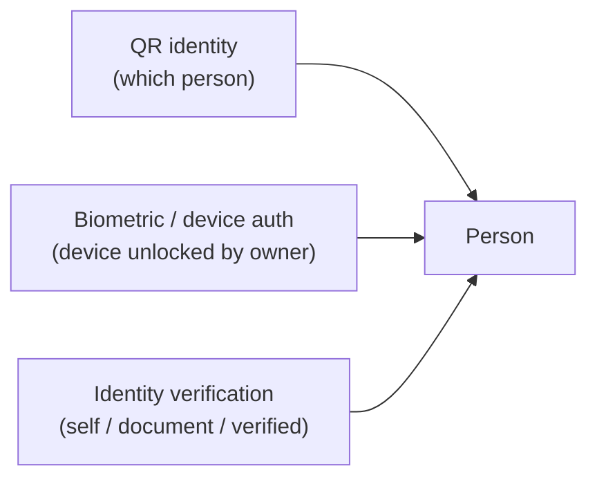

# QR Credentials Model

> QR credential trust model: permanent Sports ID QR vs temporary event
> credentials, and the separation of QR identity, biometric auth, and identity
> verification. See ADR-007, R8–R10.

## Two credential kinds (R9)

```typescript
interface QrCredential {
  id: Id<"QrCredential">;
  tenantId: Id<"Tenant">;
  personId: Id<"Person">;
  kind: QrCredentialKind;
  payloadToken: string;
  expiresAt: ISODateString | null;
  rotatedAt: ISODateString | null;
  revoked: boolean;
}

type QrCredentialKind = "permanent_sports_id" | "event_credential";
```

| | Permanent Sports ID QR | Event credential |
|---|---|---|
| Scope | Person (identity) | Person + Event (authorization) |
| Lifetime | Long-lived, tied to Sports ID | Short-lived, event-window bound |
| Rotation | Rare, on compromise/re-issue | Dynamic, per-event or per-day |
| Purpose | "Who is this person?" | "Is this person authorized for this event right now?" |
| `expiresAt` | null (or far future) | event-specific expiry |

These are separate concepts with separate lifecycles. A person presents their
permanent QR for identity and a dynamic event credential for event access
(e.g. check-in, scoring authority). Conflating them would leak event-specific
trust into permanent identity.

## No sensitive data in the QR (R8)

The QR encodes only an opaque `payloadToken`. The token is a server-resolvable
reference:

- The QR **does not** contain name, DOB, contact, health, or any profile data.
- The scanner sends the token to the platform; the platform resolves it to a
  Person (and, for event credentials, an Event) server-side.
- This means a leaked or photographed QR reveals nothing useful and can be
  revoked/rotated without exposing the person's data.

## Three separate concepts (R10)



- **QR identity** — "which person does this credential point to?" Resolved
  server-side from `payloadToken`.
- **Biometric/device authentication** — "is this device unlocked by its
  owner?" Handled by the `BiometricsPort` adapter. Does not prove identity
  verification; it proves device possession + biometric unlock.
- **Identity verification** — "has this person been verified to a level?"

```typescript
interface IdentityVerification {
  id: Id<"IdentityVerification">;
  personId: Id<"Person">;
  level: IdentityVerificationLevel;
  verifiedAt: ISODateString | null;
}

type IdentityVerificationLevel = "none" | "self" | "document" | "verified";
```

These **compose** but none **implies** another:

- A person can have a QR (identity) without biometrics enabled (device auth).
- A person can have biometric login without identity verification.
- A verified person may have a revoked QR.

Authorization decisions that require high trust (e.g. issuing a permanent
Sports ID, verifying a championship result) check `IdentityVerificationLevel`,
not the presence of a QR or biometric.

## Rotation and revocation

- **Rotation** — issuing a new credential with a new `payloadToken` and
  revoking the old. `rotatedAt` records the rotation. Permanent QR rotation
  is rare and audited; event credential rotation is routine.
- **Revocation** — `revoked: true`. A revoked credential's token resolves to
  "revoked" server-side; it must never grant access. Revocation is append-only
  in effect (the credential record is updated, but an audit event is
  published).

## Trust model summary

| Claim | Established by |
|---|---|
| "This QR points to Person P" | Server-side resolution of `payloadToken` (QR identity) |
| "Person P is present at this device" | Biometric/device unlock (BiometricsPort) |
| "Person P is a verified real person" | IdentityVerification level ≥ `document`/`verified` |
| "Person P is authorized for Event E now" | Valid (non-expired, non-revoked) event credential |

A secure flow (e.g. official scoring an event) may require **all four**:
verified identity + device biometrics + valid event credential + QR
resolving to an official-role Person. Each is checked independently.

## Deletion safety (R20)

Revoking credentials on account soft-delete does not delete the Person's
identity archive or historical records. The QR tokens become permanently
unresolvable, but results and achievements persist.
