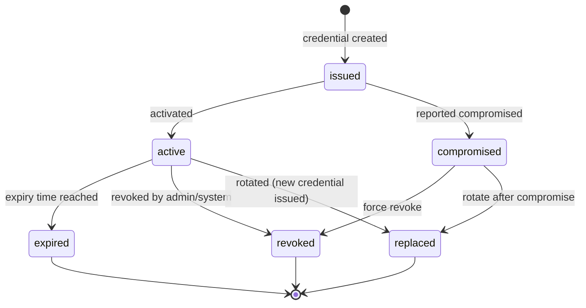
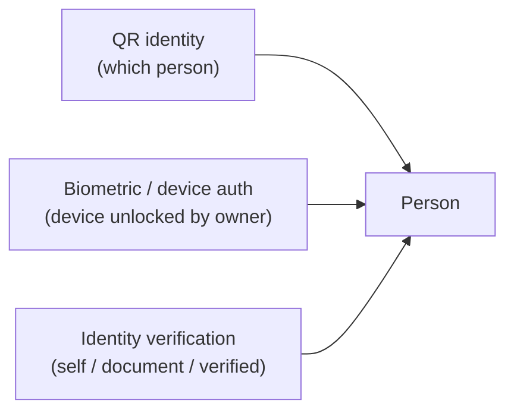

# QR Credentials Model

> QR credential trust model: permanent Sports ID QR vs temporary event
> credentials, credential lifecycle, and the separation of QR identity,
> biometric auth, and identity verification. See ADR-007, R8–R10.

## [C] SportsId and QrCredential are separate

The Sports ID is the permanent identity value. A QrCredential is a rotatable,
revocable artifact that points to a person. **Rotating or revoking a QR
credential never changes the Person's SportsId.** The SportsId persists
independently of any credential's lifecycle state.

## Two credential kinds (R9)

```typescript
interface QrCredential {
  id: Id<"QrCredential">;
  personId: Id<"Person">;
  kind: QrCredentialKind;
  payloadToken: string;
  status: QrCredentialStatus;
  expiresAt: ISODateString | null;
  issuedAt: ISODateString;
  rotatedAt: ISODateString | null;
  revokedAt: ISODateString | null;
  replacedById: Id<"QrCredential"> | null;
}

type QrCredentialKind = "permanent_sports_id" | "event_credential";
```

| | Permanent Sports ID QR | Event credential |
|---|---|---|
| Scope | Person (identity) | Person + Event (authorization) |
| Lifetime | Long-lived, tied to Sports ID | Short-lived, event-window bound |
| Rotation | Rare, on compromise/re-issue | Dynamic, per-event or per-day |
| Purpose | "Who is this person?" | "Is this person authorized for this event right now?" |
| `expiresAt` | null (or far future) | event-specific expiry |
| Ownership [C] | Person-owned (no tenantId) | Event-scoped (tenant-owned) |

## [C] Credential lifecycle

QR credentials support a full lifecycle with explicit states:



| State | Meaning |
|---|---|
| `issued` | Created but not yet active (e.g. pending activation) |
| `active` | Valid and usable |
| `expired` | Past `expiresAt`; no longer valid |
| `revoked` | Explicitly revoked by admin/system |
| `replaced` | Superseded by a new credential (`replacedById` points to replacement) |
| `compromised` | Reported compromised; must be revoked or rotated |

Key properties:
- A credential in any non-`active` state must never grant access.
- `replacedById` links an old credential to its replacement, creating an
  audit chain.
- `rotatedAt` and `revokedAt` record when transitions happened.
- Credential lifecycle transitions are auditable events.

## No sensitive data in the QR (R8)

The QR encodes only an opaque `payloadToken`. The token is a server-resolvable
reference:

- The QR **does not** contain name, DOB, contact, health, or any profile data.
- The scanner sends the token to the platform; the platform resolves it to a
  Person (and, for event credentials, an Event) server-side.
- A leaked or photographed QR reveals nothing useful and can be
  revoked/rotated without exposing the person's data or changing their SportsId.

## Three separate concepts (R10)



- **QR identity** — "which person does this credential point to?" Resolved
  server-side from `payloadToken`.
- **Biometric/device authentication** — "is this device unlocked by its
  owner?" Handled by the `BiometricsPort` adapter. Does not prove identity
  verification; it proves device possession + biometric unlock.
- **Identity verification** — "has this person been verified to a level?"

```typescript
interface IdentityVerification {
  id: Id<"IdentityVerification">;
  personId: Id<"Person">;
  level: IdentityVerificationLevel;
  verifiedAt: ISODateString | null;
}

type IdentityVerificationLevel = "none" | "self" | "document" | "verified";
```

These **compose** but none **implies** another:

- A person can have a QR (identity) without biometrics enabled (device auth).
- A person can have biometric login without identity verification.
- A verified person may have a revoked QR.

Authorization decisions that require high trust (e.g. issuing a permanent
Sports ID, verifying a championship result) check `IdentityVerificationLevel`,
not the presence of a QR or biometric.

## Rotation and revocation (corrected)

- **Rotation** — issuing a new credential with a new `payloadToken`, marking
  the old credential `replaced` with `replacedById` pointing to the new one.
  `rotatedAt` records the rotation. The SportsId is **never** changed by
  rotation. Permanent QR rotation is rare and audited; event credential
  rotation is routine.
- **Revocation** — setting `status: "revoked"` and `revokedAt`. A revoked
  credential's token resolves to "revoked" server-side; it must never grant
  access.
- **Compromise** — setting `status: "compromised"` when a credential is
  reported leaked. A compromised credential must be revoked or rotated
  before the person can use a new one.

## Trust model summary

| Claim | Established by |
|---|---|
| "This QR points to Person P" | Server-side resolution of `payloadToken` (QR identity) |
| "Person P is present at this device" | Biometric/device unlock (BiometricsPort) |
| "Person P is a verified real person" | IdentityVerification level ≥ `document`/`verified` |
| "Person P is authorized for Event E now" | Active (non-expired, non-revoked) event credential |

A secure flow (e.g. official scoring an event) may require **all four**:
verified identity + device biometrics + active event credential + QR
resolving to an official-assigned Person. Each is checked independently.

## Deletion safety (R20, corrected)

On account closure or Person archival, active QR credentials are revoked. The
SportsId remains (it is permanent). Historical records persist. After the
retention period, the Person's personal data may be anonymized; the credential
tokens become permanently unresolvable, but results and achievements persist
with anonymized references. See `audit-integrity.md`, ADR-011.
