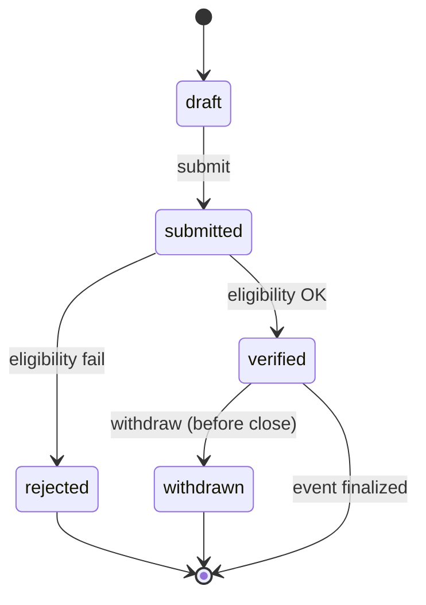
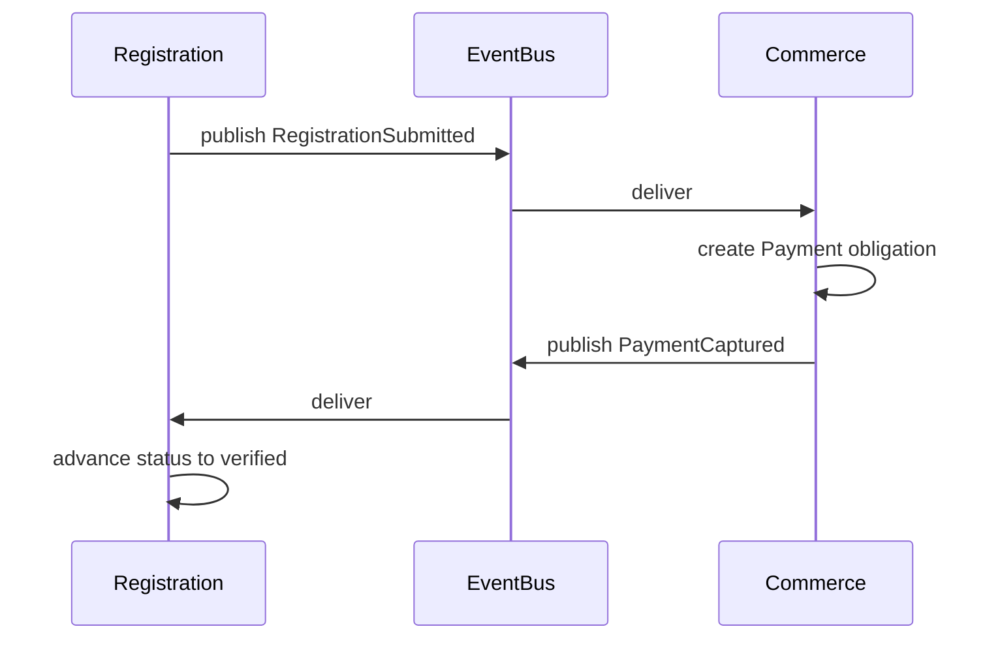

# Registration Model

> Registration boundary, eligibility, and the participant-vs-payer separation.
> See ADR-008, R18.

## Registration boundary

`Registration` is the act of entering a participant into a competition event.
It is its own bounded context, separate from Competition (which owns event
structure) and Commerce (which owns money). Registration links a participant
to an event and triggers payment.

```typescript
interface Registration {
  id: Id<"Registration">;
  tenantId: Id<"Tenant">;
  eventId: Id<"Event">;
  participantKind: "individual" | "team";
  participantId: Id<"Athlete"> | Id<"Team">;
  payerPersonId: Id<"Person">;
  status: RegistrationStatus;
}

type RegistrationStatus =
  | "draft" | "submitted" | "verified" | "rejected" | "withdrawn";
```

## Participant vs Payer (R18)

The **participant** is who competes (an Athlete or a Team). The **payer** is
who pays the entry fee (a Person). They are separate fields on the
Registration:

- `participantId` — the Athlete or Team that will compete.
- `payerPersonId` — the Person whose money funds the entry.

Common cases:

| Participant | Payer | Why separate |
|---|---|---|
| Minor athlete | Guardian (Person) | Minor cannot pay; guardian pays. |
| Athlete | Self (Person) | Self-funded. |
| Team | Team manager (Person) | Organization/team pays. |
| Athlete | Sponsor (Person/Org agent) | Sponsored entry. |

Decoupling these means a payment can be refunded without voiding the
registration's participant slot, and a participant can be swapped (within
eligibility rules) without re-charging the payer.

## Registration lifecycle



A Registration moves through statuses driven by eligibility checks and
time windows. Only `verified` registrations produce competition results.

## Eligibility (future)

Eligibility rules (age, gender, residency, ranking, membership) are evaluated
by the Registration context using data referenced from Identity (Person DOB,
guardian), Sports (Athlete participation), and Organizations (membership).
Eligibility is a future rules engine; its inputs are typed IDs and read
models, keeping the boundary clean. No eligibility implementation this sprint.

## Registration vs Competition boundary

- Competition owns the event and its capacity/format.
- Registration owns who is entered.
- Registration queries Competition for event capacity and registration windows
  via read models / events — it does not mutate Competition aggregates.

## Registration vs Commerce boundary

Registration does **not** move money. When a Registration is `submitted`,
Registration publishes `RegistrationSubmitted`. Commerce subscribes and
creates a `Payment` obligation linked via `registrationId`. When Commerce
confirms payment, it publishes `PaymentCaptured`; Registration listens and
advances status. This keeps money concerns out of the registration aggregate
and lets payment providers be swapped (R24).



## Minors & guardians (R19)

For a minor athlete, the `payerPersonId` is typically the guardian's
`PersonId`, and the guardian must hold the `guardian` role scoped to the
minor. Consent is recorded on the Registration (future field). This composes
with the identity model's `guardianId` relationship.
