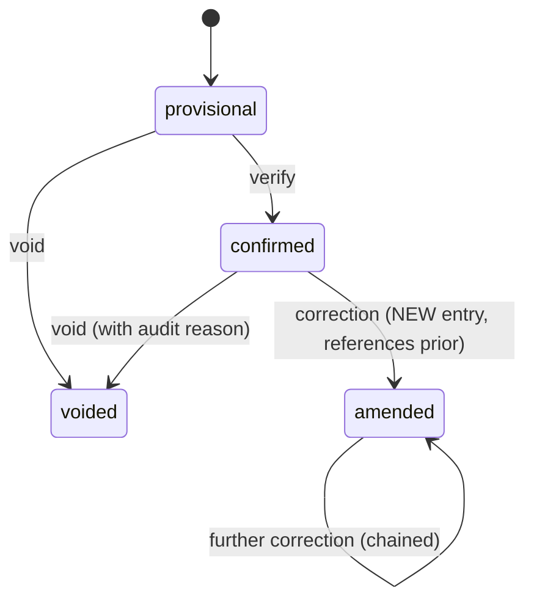

# Results & Achievements Model

> Competition results, achievements/championships, and immutability.
> See R5, R6, `audit-integrity.md`.

## Results boundary

The Results context owns **competition outcomes**. Competition owns the event
structure; Registration owns who is entered; Results owns what happened. This
separation is what makes historical records auditable and protected (R5).

```typescript
interface CompetitionResult {
  id: Id<"Result">;
  tenantId: Id<"Tenant">;
  eventId: Id<"Event">;
  participantId: Id<"Athlete"> | Id<"Team">;
  participantKind: "individual" | "team";
  status: ResultStatus;
  recordedAt: ISODateString;
  payload: ResultPayload;
}

type ResultStatus = "provisional" | "confirmed" | "amended" | "voided";

type ResultPayload =
  | { kind: "timed"; durationMs: number }
  | { kind: "measured"; value: number; unit: string }
  | { kind: "score"; score: number }
  | { kind: "placement"; place: number }
  | { kind: "judged"; totalScore: number; panelId: string };
```

## Immutability (R5)

Results are **append-only**. The lifecycle is:



- A `confirmed` result is never overwritten. A correction creates a new
  `amended` result entry that references the prior entry (via a future
  `supersededBy`/`supersedes` link). The original remains.
- `voided` is terminal and recorded with a reason. Voiding does not delete.

This guarantees an audit trail: any point-in-time view of results can be
reconstructed from the append-only sequence.

## Result payload types

The discriminated `payload` supports all competition measures (R11):

| `payload.kind` | Use |
|---|---|
| `timed` | races (duration in ms) |
| `measured` | jumps/throws (value + unit) |
| `score` | head-to-head, round-robin |
| `placement` | road races, mass events |
| `judged` | gymnastics, etc. (panel total) |

Adding a new payload kind (e.g. `tiebreak`) is a non-breaking addition.

## Achievements vs Rewards (R6)

`Achievement` is a **verifiable historical record**, separate from spendable
rewards:

```typescript
interface Achievement {
  id: Id<"Achievement">;
  tenantId: Id<"Tenant">;
  athleteId: Id<"Athlete">;
  sportId: Id<"Sport">;
  kind: AchievementKind;
  sourceResultId: Id<"Result">;
  verifiedAt: ISODateString | null;
}

type AchievementKind =
  | "champion" | "runner_up" | "third_place"
  | "medalist" | "record_holder" | "participant_milestone";
```

- An Achievement references the `sourceResultId` it was derived from.
- Achievements are **verified** (R17-style verification) before they appear on
  a Sports Passport.
- Issuing an Achievement does **not** issue Sports Points. Points issuance is
  a separate decision in the Rewards context. See `rewards-model.md`, ADR-006.

## Statistics and rankings (future)

Statistics and rankings are **derived read models** computed from confirmed
results and achievements. They are not aggregates. A future statistics context
(or read-model projector) consumes `ResultConfirmed` events and updates
projections. Not built this sprint.

## Championships (future)

A "championship" is a high-order achievement (e.g. season champion) that may
aggregate multiple event results. It is modeled as an `Achievement` with
`kind: "champion"` and a `sourceResultId` pointing to a deciding result, plus
future metadata. The model extends without new aggregates.

## Deletion safety (R20)

Results and Achievements are never deleted, even if the Person's account is
soft-deleted. They reference the `Athlete` (which references the archived
`Person`). Historical sports records persist. See `audit-integrity.md`.
