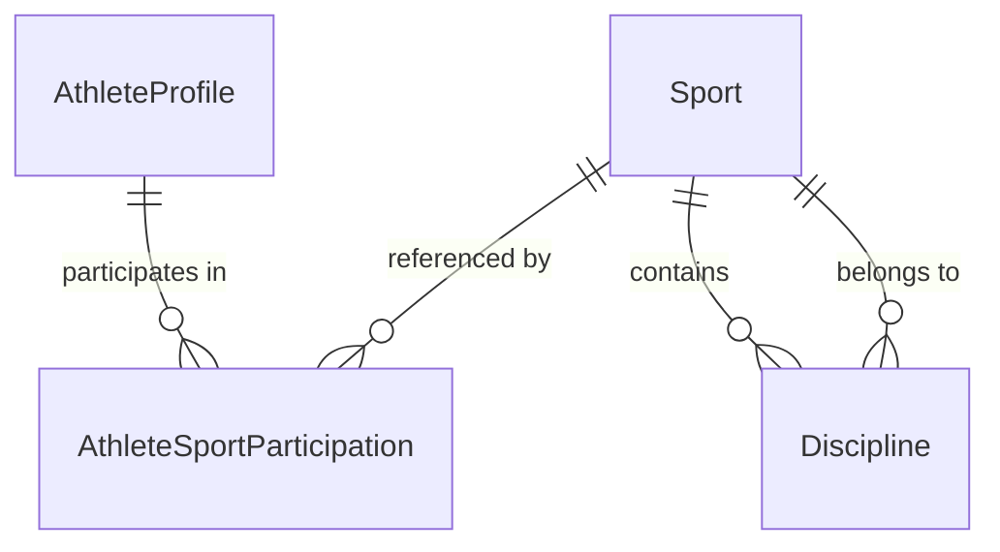

# Sports Model

> Sport vs Discipline vs Competition Event, and the multi-sport athlete.
> See ADR-003, ADR-005.
>
> **[S4]** A minimal `sports` reference table is now persisted (platform
> reference data, not tenant-owned) with a small deterministic seed, and
> `AthleteSportParticipation` history is durably stored with one active
> participation per athlete/sport plus re-entry. See `../persistence-model.md`.

## Sport vs Discipline

- **Sport** — a top-level sport (Basketball, Swimming, Track & Field).
- **Discipline** — a specialised branch within a sport (100m sprint within
  Track & Field; 50m freestyle within Swimming).

```typescript
interface Sport { id: Id<"Sport">; code: string; name: string; }
interface Discipline {
  id: Id<"Discipline">;
  sportId: Id<"Sport">;
  code: string;
  name: string;
  measure: CompetitionMeasure;
}
```

A Discipline carries a `measure` that drives how its events are scored:

| `CompetitionMeasure` | Example |
|---|---|
| `timed` | 100m sprint |
| `measured_distance` | long jump |
| `measured_score` | basketball points |
| `judged` | gymnastics |
| `head_to_head` | boxing match |
| `placement` | road race finishing order |

## Athlete ↔ Sport (many-to-many) [S3]

The Athlete↔Sport relationship is owned by the dedicated **Athlete** bounded
context (ADR-019), not by the Sports Catalog. The Sports Catalog owns only the
catalog (`Sport`, `Discipline`) and knows nothing about athletes; the Athlete
context references a `Sport` by `Id<"Sport">` and copies no catalog data.
`AthleteSportParticipation` is the many-to-many link:

```typescript
// src/domain/athlete/athlete.types.ts
interface AthleteSportParticipation {
  id: Id<"AthleteSportParticipation">;
  athleteProfileId: Id<"AthleteProfile">;
  sportId: Id<"Sport">;
  status: "active" | "ended";
  startedAt: ISODateString;
  endedAt: ISODateString | null;
}
```

A single `AthleteProfile` (one per Person, sport-independent — R3) may
participate in many sports simultaneously (R4). Leaving a sport is a
non-destructive lifecycle change (`status: "ended"` + `endedAt`); participation
is never deleted. This relationship is participation only — it is NOT
competition entry, registration, team membership, or result/ranking history.



## AthleteProfile is sport-independent [S3]

The `AthleteProfile` carries only `personId`, `status`, and `createdAt` — no
sport, no tenantId, and no Person identity data. This is the core of ADR-003:
athlete identity is independent of sport. Sport linkage lives on
`AthleteSportParticipation`, not on `AthleteProfile`. See `identity-model.md`
and ADR-019 for the full model.

## Sport vs Competition Event

**Sport/Discipline** are catalog reference data — slow-changing, shared across
tenants. **CompetitionEvent** is a specific contest happening at a specific
time, organized by a specific organization, scored by a specific measure. The
Competition context owns events; the Sports context owns the catalog. A
CompetitionEvent references a `sportId` and optional `disciplineId` from the
catalog. See `competition-model.md`.

## Sports catalog ownership

The Sports Catalog context owns `Sport` and `Discipline`. Other contexts
reference them by typed ID only. The catalog is a shared reference; in a
multi-tenant world it may be tenant-overridable in the future, but the core
catalog is global to keep cross-tenant competition semantics consistent.

## Sports Passport (future, derived)

The Sports Passport is a derived **read model / projection** aggregating a
Person's identity, AthleteProfile, sport participations, and (eventually) teams,
verified competition participation, results, achievements, statistics, and
rankings. It is NOT an aggregate and is not stored inside `AthleteProfile`; it
is composed from multiple contexts at read time and excludes private identity
data (e.g. date of birth) by default. Not built this sprint (ADR-019).
