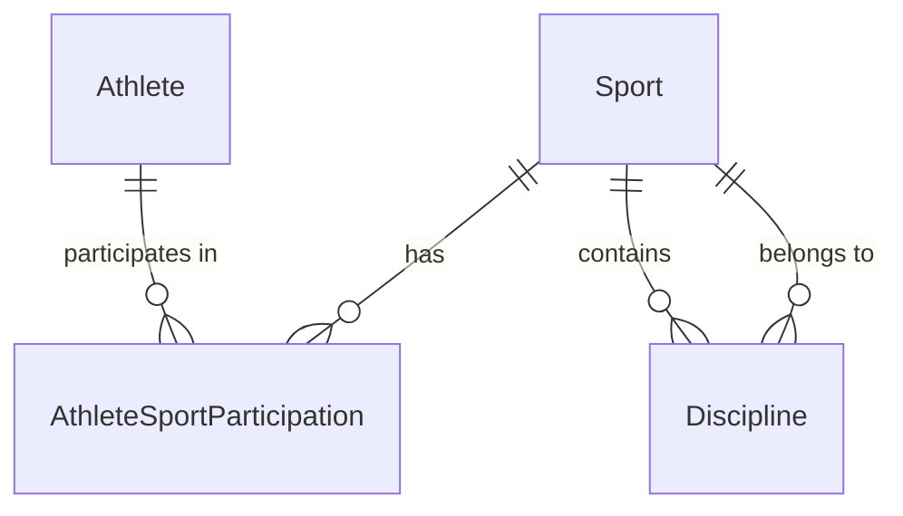

# Sports Model

> Sport vs Discipline vs Competition Event, and the multi-sport athlete.
> See ADR-003, ADR-005.

## Sport vs Discipline

- **Sport** — a top-level sport (Basketball, Swimming, Track & Field).
- **Discipline** — a specialised branch within a sport (100m sprint within
  Track & Field; 50m freestyle within Swimming).

```typescript
interface Sport { id: Id<"Sport">; code: string; name: string; }
interface Discipline {
  id: Id<"Discipline">;
  sportId: Id<"Sport">;
  code: string;
  name: string;
  measure: CompetitionMeasure;
}
```

A Discipline carries a `measure` that drives how its events are scored:

| `CompetitionMeasure` | Example |
|---|---|
| `timed` | 100m sprint |
| `measured_distance` | long jump |
| `measured_score` | basketball points |
| `judged` | gymnastics |
| `head_to_head` | boxing match |
| `placement` | road race finishing order |

## Athlete ↔ Sport (many-to-many)

`AthleteSportParticipation` is the many-to-many link:

```typescript
interface AthleteSportParticipation {
  athleteId: Id<"Athlete">;
  sportId: Id<"Sport">;
  disciplineId: Id<"Discipline"> | null;
  active: boolean;
}
```

A single Athlete (one per Person, sport-independent — R3) may participate in
many sports and disciplines over their lifetime (R4). `active` indicates
current participation; historical participation is retained.



## Athlete is sport-independent

The `Athlete` entity carries only `personId` and `tenantId` — no sport. This is
the core of ADR-003: athlete identity is independent of sport. Sport-specific
data lives on `AthleteSportParticipation`, not on `Athlete`.

```typescript
interface Athlete {
  id: Id<"Athlete">;
  personId: Id<"Person">;
  tenantId: Id<"Tenant">;
}
```

## Sport vs Competition Event

**Sport/Discipline** are catalog reference data — slow-changing, shared across
tenants. **CompetitionEvent** is a specific contest happening at a specific
time, organized by a specific organization, scored by a specific measure. The
Competition context owns events; the Sports context owns the catalog. A
CompetitionEvent references a `sportId` and optional `disciplineId` from the
catalog. See `competition-model.md`.

## Sports catalog ownership

The Sports Catalog context owns `Sport` and `Discipline`. Other contexts
reference them by typed ID only. The catalog is a shared reference; in a
multi-tenant world it may be tenant-overridable in the future, but the core
catalog is global to keep cross-tenant competition semantics consistent.

## Sports Passport (future, derived)

The Sports Passport is a derived read model aggregating a Person's identity,
Athlete projection, sport participations, and verified achievements. It is not
an aggregate; it is composed from multiple contexts. Not built this sprint.
