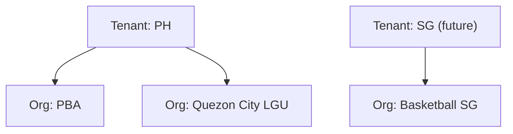

# Tenancy

> Multi-tenancy and organization isolation. See ADR-004, R14.

## Tenant as isolation boundary

A **Tenant** is the top-level isolation boundary. Every tenant-scoped entity
carries a `tenantId`. A Tenant typically corresponds to a deployment/region
or a top-level governing entity (e.g. a national sport association, a
country instance). Tenants are explicit; cross-tenant access is never
implicit.

## Tenant ownership rules

1. **Every tenant-scoped entity stores `tenantId`.** This is a non-null
   column/field on all context entities (Person, Organization, Team,
   EventContainer, CompetitionEvent, Registration, Payment, Result,
   Achievement, RewardsLedgerEntry, QrCredential).
2. **Repositories filter by `tenantId` by default.** Application services
   receive the current tenant from context (session/deployment) and pass it
   to repositories. A repository must never return rows from another tenant.
3. **Cross-tenant access requires explicit, audited escalation.** There is no
   accidental cross-tenant read. A future platform-admin role may operate
   cross-tenant under strict audit.
4. **Reference data may be global.** The Sports catalog (Sport, Discipline)
   is global reference data, not tenant-scoped, so competition semantics stay
   consistent across tenants. Tenants may layer overrides in the future.
5. **Tenants are not Organizations.** A Tenant is the isolation boundary; an
   Organization is a member of a Tenant. Many Organizations live within one
   Tenant.

## Tenant vs Organization

| | Tenant | Organization |
|---|---|---|
| Role | Isolation boundary | Structured body within a tenant |
| Owns data? | Scopes all data | Owns teams, events |
| Example | "Philippines instance" | "Quezon City Basketball Club" |
| Can be many per tenant? | n/a | Yes |

## Multi-country expansion (R12, geography)

Tenants map naturally to countries/regions for expansion. Geography is a
generic typed-place model (ISO 3166-1 country + ordered admin levels), not
hard-coded Philippine structures — so a new tenant for another country needs
no schema change. See `geography-localization.md`.

## Tenant in identifiers

Tenant isolation is enforced at the repository layer, not by embedding tenant
in IDs. IDs are globally unique (generated via the `IdGenerator` port). The
`tenantId` field on each entity is the isolation key queried against.

## Future: tenant-specific configuration

Future tenant configuration (currency default, locale, branding, feature
flags) is a Tenant-settings aggregate, not built this sprint. The
architecture supports it without core changes because configuration is read
at the application layer and passed into use cases.

## What is NOT multi-tenant this sprint

- No tenant management UI.
- No tenant provisioning workflow.
- No cross-tenant admin tooling.
These are future. The **model** enforces tenancy now so retrofitting it later
is not a data migration.
