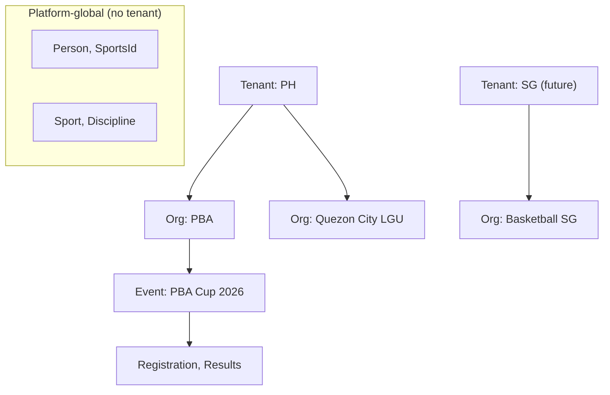

# Tenancy

> Multi-tenancy, organization isolation, and ownership classifications.
> See ADR-004, ADR-010, R14.

## [C] Ownership classifications

Sprint 0.1 corrects the Sprint 0 assumption that every entity is tenant-owned.
Entities are classified into six ownership types. Only organization/tenant-owned
and event-scoped entities carry `tenantId`.

| Classification | Description | Carries `tenantId`? | Examples |
|---|---|---|---|
| **Platform-global** | Platform-level identity and configuration. Exists outside any tenant. | No | `Person`, `SportsId` |
| **Reference data** | Canonical catalog data shared across all tenants. | No | `Sport`, `Discipline` |
| **Person-owned** | Created by/for a Person, belonging to that person across contexts. | No | `AthleteProfile`, `IdentityVerification`, `QrCredential` (permanent) |
| **Organization/tenant-owned** | Belongs to an Organization within a Tenant. | Yes | `Organization`, `Team`, `OrganizationMembership`, `OrganizationRoleAssignment` |
| **Event-scoped** | Tied to a specific event/competition within a tenant. | Yes | `CompetitionEvent`, `Competition`, `Division`, `Stage`, `Contest`, `Registration`, `EventAssignment`, `TeamMembership` |
| **Historical/audit** | Immutable historical records. Retained per retention policy, not deleted. | Yes (origin tenant) | `CompetitionResult`, `Achievement`, `PaymentTransaction`, `Refund`, `Settlement`, `RewardsLedgerEntry` |

### Key corrections

- **Person and SportsId are platform-global identities.** They do NOT carry
  `tenantId` and do NOT belong to the first organization/event in which the
  person participates. A person may participate across multiple organizations
  and tenants over time; their identity persists across all of them.
- **Sport and Discipline are platform reference data.** Not tenant-scoped. A
  future controlled customization model may allow tenant-specific extensions,
  but the core catalog is global.
- **AthleteProfile is person-owned.** It is created by/for a Person and is not
  owned by any organization. An organization may field a person on a team via
  `TeamMembership`, but the AthleteProfile itself belongs to the Person.
- **QrCredential (permanent) is person-owned.** Event credentials are
  event-scoped (tenant-owned).
- **Historical/audit records** carry the `tenantId` of their origin tenant for
  query scoping, but their retention is governed by audit/retention policy,
  not by tenant lifecycle.

## Tenant as isolation boundary

A **Tenant** is the top-level isolation boundary for organization/tenant-owned
and event-scoped data. A Tenant typically corresponds to a deployment/region
or a top-level governing entity (e.g. a national sport association, a country
instance). Tenants are explicit; cross-tenant access is never implicit.

## Tenant ownership rules (corrected)

1. **Only organization/tenant-owned and event-scoped entities store `tenantId`.**
   Platform-global, reference data, and person-owned entities do NOT carry
   `tenantId`.
2. **Repositories for tenant-owned entities filter by `tenantId` by default.**
   Application services receive the current tenant from context and pass it to
   repositories. A repository must never return rows from another tenant.
3. **Cross-tenant access requires explicit, audited escalation.** There is no
   accidental cross-tenant read. A future platform-admin role may operate
   cross-tenant under strict audit.
4. **Reference data is global.** The Sports catalog is not tenant-scoped.
   Tenants may layer overrides in a future controlled customization model.
5. **Tenants are not Organizations.** A Tenant is the isolation boundary; an
   Organization is a member of a Tenant. Many Organizations live within one
   Tenant.
6. **A Person's identity is portable across tenants.** A Person may participate
   in organizations/events in different tenants over time. Their Person and
   SportsId records remain platform-global.

## Tenant vs Organization

| | Tenant | Organization |
|---|---|---|
| Role | Isolation boundary for tenant-owned data | Structured body within a tenant |
| Owns data? | Scopes tenant-owned and event-scoped data | Owns teams, events |
| Example | "Philippines instance" | "Quezon City Basketball Club" |
| Can be many per tenant? | n/a | Yes |

## Multi-country expansion (R12, geography)

Tenants map naturally to countries/regions for expansion. Geography is a
generic typed-place model (ISO 3166-1 country + ordered admin levels), not
hard-coded Philippine structures — so a new tenant for another country needs
no schema change. See `geography-localization.md`.

## Tenant in identifiers

Tenant isolation is enforced at the repository layer, not by embedding tenant
in IDs. IDs are globally unique (generated via the `IdGenerator` port). The
`tenantId` field on tenant-owned entities is the isolation key queried against.

## Future: tenant-specific configuration

Future tenant configuration (currency default, locale, branding, feature
flags) is a Tenant-settings aggregate, not built this sprint. The
architecture supports it without core changes because configuration is read
at the application layer and passed into use cases.

## What is NOT multi-tenant this sprint

- No tenant management UI.
- No tenant provisioning workflow.
- No cross-tenant admin tooling.
These are future. The **model** classifies ownership now so retrofitting it
later is not a data migration.
